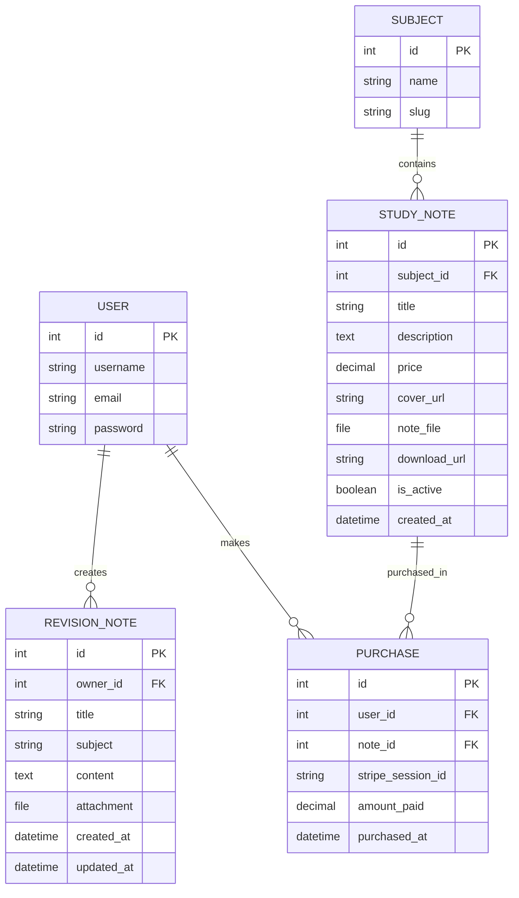
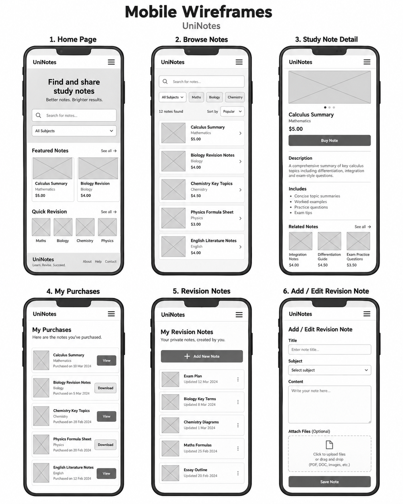
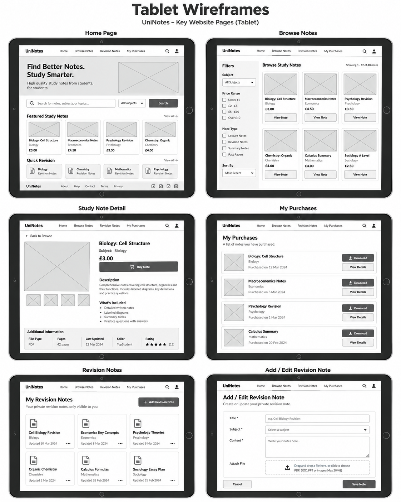
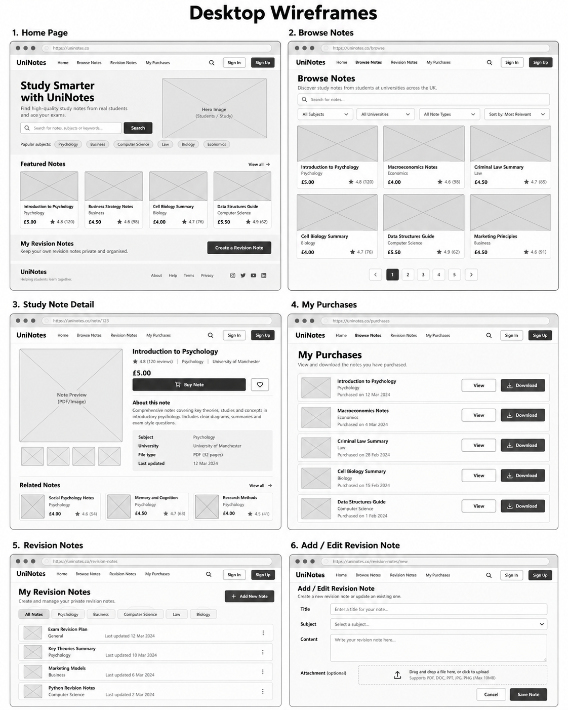
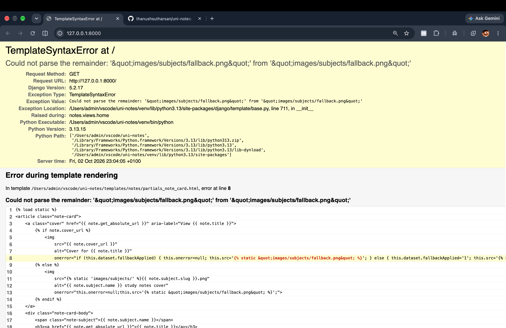
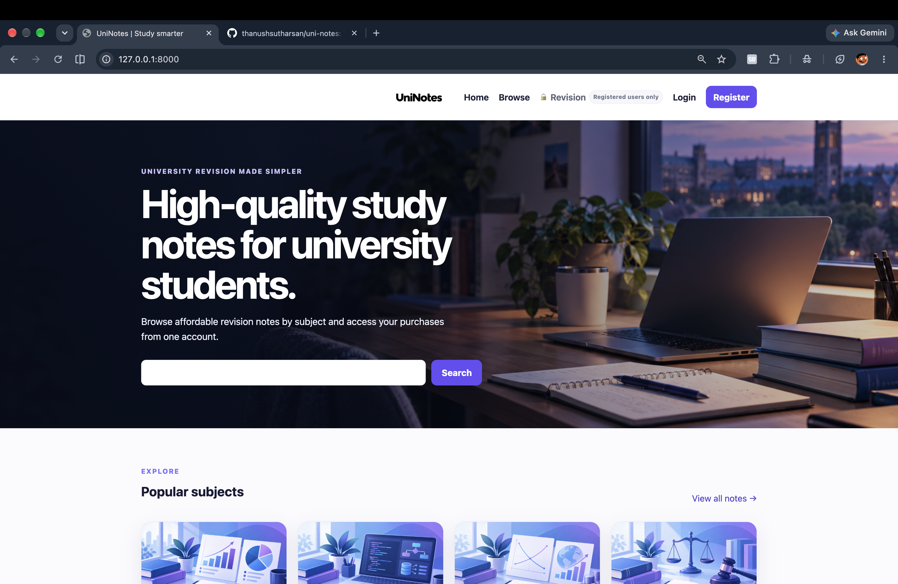
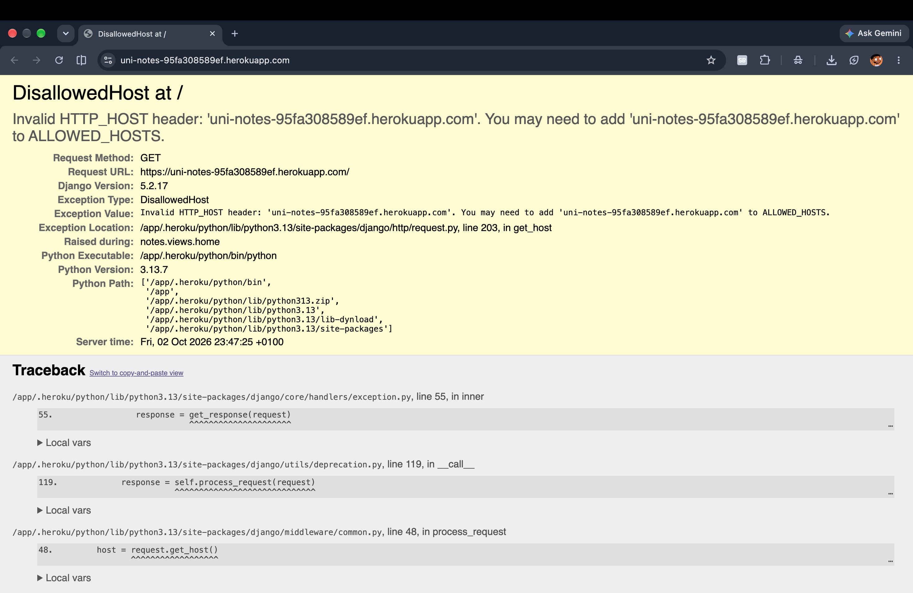
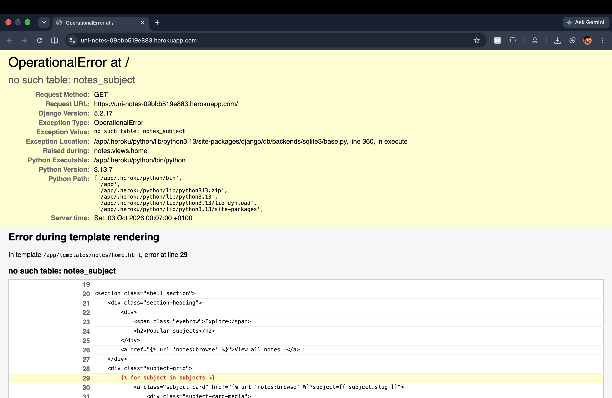
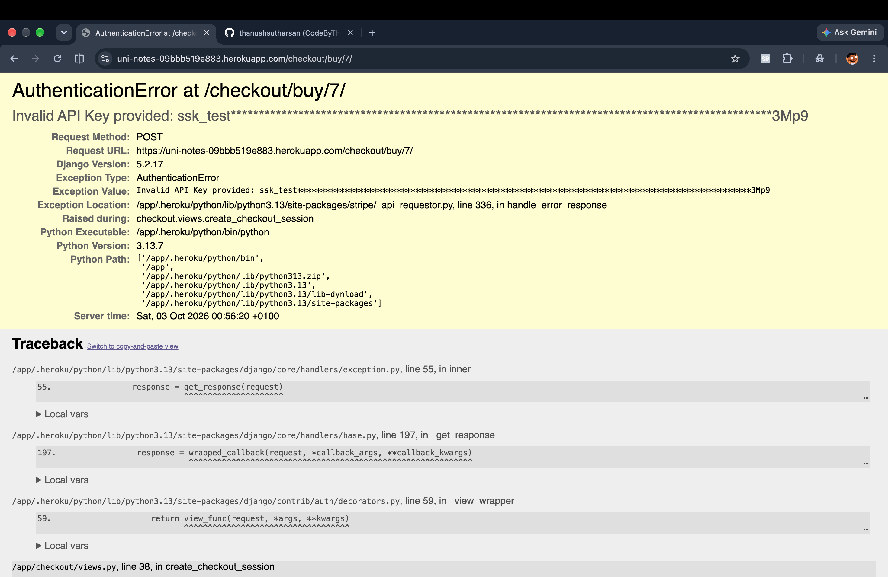

# UniNotes - A Simplfied Notes App (FULL-STACK)

## Description

UniNotes is a full-stack Django web application designed for university students who want a simple and organised way to access revision resources and manage their own study notes.

The application combines a study-note marketplace with a personal revision area. Students can register for an account, browse available study notes, search for resources, filter notes by subject, view individual note details and purchase resources through Stripe Checkout. Once a payment has been successfully confirmed, the purchased resource is added to the student's account and can be accessed through their personal purchase library.

Registered users can also create and manage their own private revision notes. These notes can be created, viewed, edited and deleted by their owner, providing full CRUD functionality while ensuring that users cannot access or modify another student's private revision content.

UniNotes uses Django, Python, HTML, CSS and JavaScript together with a relational database, Django authentication and Stripe payment processing to provide a complete full-stack application.

## Purpose

The purpose of **UniNotes** is to provide university students with a simple and organised platform for accessing revision resources and managing their own study material. The application brings together two main areas of revision in one place: students can browse and purchase prepared study notes, while also creating and managing their own private revision notes through their account.

Users can search the available study-note library using keywords or filter resources by subject, allowing them to find relevant material more efficiently. Each study note has its own page containing information such as the subject, title, description and price. Registered users can purchase notes through Stripe Checkout, and completed purchases are stored within their account so that the resources can be accessed and downloaded again from the **My Purchases** section.

UniNotes also provides a personal revision area. Logged-in users can create revision notes containing a title, subject and written content, with the option to upload a supporting file. These notes can later be viewed, edited or deleted. This gives students a private space to organise their own revision alongside the resources they have purchased.

Overall, the purpose of the project is to create a useful study platform that makes revision resources easier to find, access and organise.

## Project Rationale

### Problem Being Solved

University students often use several different methods to organise their revision. Study resources may be downloaded from different websites, saved in different folders or stored separately from a student's own notes. This can make revision less organised and can make it more difficult to quickly locate the material needed for a particular subject.

Another problem is finding relevant revision resources efficiently. When a large amount of material is available, students need a clear way of locating notes that relate to the subject or topic they are studying.

UniNotes addresses these problems by providing a centralised study platform. Available study notes are organised by subject and can be searched using keywords. Students can therefore narrow down the available resources instead of manually looking through unrelated material.

The application also links purchased resources to the user's account. Once a purchase has been successfully confirmed, the purchased note appears within the user's personal purchases area and can be downloaded from there. This provides a clearer way of keeping track of resources that the student has already obtained.

In addition, UniNotes allows students to create and maintain their own revision notes. Each user's revision notes are associated with their own account, meaning they have a personal study area where they can create, view, update and delete their material.


### Why This Project Was Chosen

This project was chosen because revision and organisation are common requirements for university students and therefore provide an appropriate real-world problem for a web application to solve.

A study platform also provides the opportunity to develop functionality that goes beyond displaying static information. UniNotes requires users to interact with stored data in several different ways, including registering and logging into an account, searching and filtering study notes, purchasing resources, downloading previously purchased material and managing personal revision notes.

The project was also chosen because it allows several realistic web-development concepts to be combined within one application. For example, the application manages relationships between users, study notes, subjects, purchases and personal revision notes. User authentication is important because purchases and private revision material must remain linked to the correct account.

The revision-note feature also provides meaningful CRUD functionality. Users can **Create** a revision note, **Read** their saved notes, **Update** existing notes and **Delete** notes they no longer require. This functionality has a genuine purpose within the application rather than being included only as a technical demonstration.

The purchasing system adds another realistic element to the project. Stripe Checkout is integrated into the application so that a payment can be processed and verified before a purchase is recorded. This makes the project more representative of the type of functionality that could be required within a real commercial web application.


### Value to Users

UniNotes provides value to users by making revision material easier to access and organise.

Students are able to browse the available study-note library and use keyword searching and subject filtering to reduce the number of irrelevant results. This improves usability because users do not need to manually search through every resource available on the website.

Creating an account provides further value because the application can provide personalised functionality. Purchased resources are connected to the authenticated user and displayed in the **My Purchases** section, giving the student a permanent record of the resources they have obtained and a convenient location from which to download them again.

The personal revision-note functionality provides an additional reason for students to use the application regularly. Rather than only using UniNotes when purchasing a resource, students can use their account as a study space. They can write their own revision content, categorise it by subject and optionally add an attachment. Existing notes can then be edited as their knowledge develops or deleted when they are no longer required.

The application therefore provides value through:

- Organised access to university study resources
- Keyword searching and subject filtering
- Individual pages containing information about each study note
- User accounts that retain purchase information
- Access to previously purchased notes from one location
- Secure payment processing through Stripe Checkout
- A private revision area for creating and managing personal notes
- Optional file attachments for personal revision material

These features work together to create a platform focused on making the student's revision process more organised and convenient.


### Real-World Application

UniNotes has a clear real-world application as an online platform for distributing digital educational resources. The overall concept is similar to existing digital marketplaces where users create accounts, search for products, complete online payments and retain access to purchased digital content.

In a real deployment, educational resources could be organised across different university subjects, allowing students to search for material that is relevant to their studies. New resources could be added to the platform over time, while the subject-based structure would allow the library to expand without changing the main way users navigate the website.

The purchase process also reflects a realistic digital-commerce workflow. A user selects a study note, completes payment through Stripe Checkout and, once the payment has been verified, a purchase record is associated with their account. The user can then access the purchased resource through their personal library.

The application also prevents the normal purchase flow from unnecessarily selling the same study note to the same user again once ownership has already been recorded.

The personal revision system extends the project beyond being only a digital shop. Students can use UniNotes as an ongoing revision tool by storing and updating their own notes alongside purchased resources.

Ownership checks are used when accessing, editing or deleting these revision notes so that one user cannot simply access another user's private notes through the normal application routes.

The project therefore demonstrates how a database-driven Django application can be applied to a genuine educational use case. It combines user authentication, database relationships, searching and filtering, CRUD functionality, file handling, payment processing and personalised content to produce an application that could be developed further into a larger university revision service.


## Technologies Used

| Category | Technology | Purpose |
|---|---|---|
| Language | **Python 3.13.7** | Used as the main back-end programming language. Python handles the application logic, Django models, views, forms, validation, authentication, database queries, CRUD functionality and payment processing. |
| Language | **HTML5** | Used to structure the content of the website, including navigation, forms, study-note information, revision pages and authentication pages. Django template syntax is used alongside HTML to display dynamic database content. |
| Language | **CSS3** | Used to style the application and create the visual layout. Custom CSS controls typography, buttons, forms, study-note cards, navigation, spacing and responsive behaviour across different screen sizes. |
| Language | **JavaScript** | Used to add client-side interaction, mainly for the responsive navigation menu. It controls opening and closing the menu and updates accessibility attributes such as `aria-expanded`. |
| Framework | **Django 5.2.17** | The main web framework used to build UniNotes. Django manages models, views, templates, URLs, forms, authentication, sessions, database interaction, file uploads, security and automated testing. |
| Library | **Stripe Python Library 12.5.1** | Allows the Django application to communicate with Stripe. It is used to create Checkout Sessions, retrieve completed sessions and verify payment information before a purchase is recorded. |
| Library | **dj-database-url 2.3.0** | Converts the `DATABASE_URL` environment variable into a database configuration Django can use. This allows different database configurations to be used in development and production. |
| Library | **Psycopg 3.2.9** | Provides PostgreSQL connectivity so the Django application can communicate with a PostgreSQL database when one is configured. |
| Library | **WhiteNoise 6.9.0** | Used to serve static files such as CSS, JavaScript and images efficiently when the application is deployed. |
| Library | **python-dotenv 1.1.1** | Used to load local environment variables from an `.env` file. This allows sensitive configuration such as secret keys, Stripe keys and database details to remain outside the main source code. |
| Library | **Gunicorn 23.0.0** | Used as the production WSGI server for the deployed Django application. The project is configured to run using `gunicorn uninotes.wsgi`. |
| API | **Stripe API** | Connects UniNotes to Stripe Checkout. It allows the application to create payment sessions and verify successful payments without directly processing users' card information within UniNotes. |
| Database | **SQLite** | Used as the default local development database. It allows the project to be developed and tested without requiring a separate database server. |
| Database | **PostgreSQL Support** | The application can use PostgreSQL when a valid `DATABASE_URL` is supplied. This provides a database option suitable for production deployment. |
| Database Technology | **Django ORM** | Allows the application to interact with database records using Python objects rather than manually writing SQL queries. It is used to manage users, subjects, study notes, purchases and revision notes. |
| Payment Technology | **Stripe Checkout** | Provides the hosted payment system used when a registered user purchases a study note. UniNotes creates the Checkout Session and verifies the result before recording the purchase. Stripe test mode is used during development and assessment. |
| Development Tool | **Visual Studio Code** | Used to create and edit the Python, HTML, CSS, JavaScript, Markdown and configuration files within the project. |
| Development Tool | **Git** | Used for version control, allowing project changes to be recorded through commits and providing a development history. |
| Development Tool | **GitHub** | Used as the remote repository for storing the project source code and Git commit history. |
| Development Tool | **Django Development Server** | Used to run and test the application locally during development using `python manage.py runserver`. |
| Development Tool | **Django Test Framework** | Used to run automated tests with `python manage.py test`, helping verify that application functionality behaves as expected. |
| Development Tool | **Django Migrations** | Used to keep the database structure synchronised with changes made to the Django models using commands such as `python manage.py migrate`. |
| Deployment Tool | **Heroku** | The deployment platform prepared for the project. Production configuration can be supplied using environment variables such as `DATABASE_URL` and `ALLOWED_HOSTS`. |

# Planning Phase
# User Experience Design (UX)

The User Experience (UX) of **UniNotes** has been designed around making university revision resources easy to find, purchase, access and organise. The application aims to reduce unnecessary steps for users and provide a clear journey from first visiting the website to accessing purchased study materials or managing personal revision notes.

The design focuses on simple navigation, clear page layouts, accessible forms, responsive behaviour and personalised functionality for registered users. Important actions such as browsing notes, searching for resources, registering, logging in, accessing purchases and creating revision notes are available through clearly identified areas of the website.

The UX has also been designed around different user states. Visitors who are not logged in can still browse available study notes and explore subjects, while registered users gain access to personalised features including **Revision** and **My Purchases**. This allows users to understand the value of the website before creating an account while protecting account-specific content.


## UX Goals

The main UX goal of UniNotes is to create a clear and efficient revision platform that university students can use without needing extensive instructions.

The key UX goals are:

- **Simple navigation** – users should be able to move between the Home, Browse, Revision and My Purchases areas without becoming confused about where features are located.
- **Efficient resource discovery** – users should be able to search for study notes using keywords and filter available resources by subject rather than manually looking through every note.
- **Clear information hierarchy** – headings, sections, cards and page titles are used to make content easier to scan and understand.
- **Minimal steps to important actions** – important functions such as searching, viewing a note, purchasing a note and accessing purchased resources should require as few unnecessary steps as possible.
- **Personalised user experience** – authenticated users should have clear access to their own purchases and private revision notes.
- **Consistent interface design** – buttons, forms, navigation elements and content cards should behave and appear consistently throughout the application.
- **Responsive usability** – the website should remain usable across different screen sizes, with navigation that can adapt to smaller displays.
- **Accessible interaction** – form fields use labels, images include alternative text where appropriate and the website provides features such as a skip-to-content link and accessible navigation labels.
- **Clear user feedback** – users should receive confirmation when important actions such as creating an account, saving a revision note, updating a note or deleting a note have been completed.
- **Useful empty states** – when no content matches a search or no content is available, the interface should explain this clearly rather than leaving the user with an unexplained blank area.

These goals support the overall purpose of UniNotes by reducing friction and allowing students to spend more time using revision resources rather than learning how to use the website.


## Target Audience

The target audience was considered when deciding which features should be prioritised within UniNotes. The application is primarily aimed at university students who need a convenient way to locate revision material and organise their studies.

The design therefore focuses on speed, simplicity and organisation rather than providing unnecessary features that could make the application more complicated.


### Primary Users

The primary users of UniNotes are **university students looking for revision and study resources**.

These users may:

- Be studying one or more university subjects
- Need additional resources to support their revision
- Want to search for notes relating to a particular subject or topic
- Prefer having digital study resources available through one account
- Want to keep track of study materials they have already purchased
- Create their own revision notes while studying
- Update revision material as their understanding develops
- Upload supporting files alongside their personal revision notes
- Access study resources from different devices

For these users, the most important parts of the user experience are being able to quickly locate relevant material, understand what a study note contains and access purchased resources without unnecessary difficulty.

The keyword search and subject filter support this audience by reducing the amount of irrelevant content users need to look through. The **My Purchases** area gives returning users a clear location for accessing resources they have already obtained.

The private revision-note functionality also supports students who want to use UniNotes as more than a marketplace. They can create, view, update and delete their own revision notes, giving them a personalised study area within the same application.


### Secondary Users

The secondary users are **students who are exploring the platform before deciding whether to register or purchase a resource**.

These users may arrive at UniNotes looking for a particular study subject without already having an account.

For this reason, important parts of the website such as the homepage, subject selection, study-note library, search functionality and individual study-note information can be explored before the user accesses account-specific functionality.

This allows potential users to understand what UniNotes offers before being required to create an account.

Unauthenticated users are also clearly shown that the Revision area is available to registered users. This provides information about additional functionality without allowing private account features to be accessed by users who are not logged in.

The experience is therefore designed to provide useful information to new visitors while giving registered users additional personalised functionality.


## User Needs

The needs of the target users influenced the functionality and structure of UniNotes.

A major user need is the ability to **find relevant study resources quickly**. University students may be looking for material relating to a specific course or topic and should not need to search manually through unrelated notes. UniNotes addresses this by providing keyword searching and subject-based filtering.

Users also need enough information to decide whether a resource is relevant before purchasing it. Individual study-note pages therefore provide information about the selected resource, including its title, subject, description and price.

Registered users need a reliable way to keep track of resources they have already purchased. The **My Purchases** section provides a personalised area where previous purchases are displayed and purchased resources can be accessed again.

Another important user need is organisation. Students often create their own revision material in addition to using external resources. UniNotes therefore allows authenticated users to maintain their own private revision notes. Users can:

- Create new revision notes
- View their saved revision notes
- Edit existing revision notes
- Delete revision notes they no longer require
- Organise notes using a subject
- Add written revision content
- Optionally attach supporting files

Privacy is also an important user need. Personal revision notes are associated with the account that created them. When revision notes are viewed, edited or deleted, the application checks that the authenticated user owns the requested note.

Users also need reassurance that their actions have been completed successfully. UniNotes provides feedback messages following important actions such as registration and revision-note management.

Overall, the main user needs identified for the project are:

- Quick access to relevant revision resources
- Clear navigation
- Search and filtering functionality
- Clear information before making a purchase
- Secure online payment
- Access to previously purchased resources
- A personalised revision area
- Control over personal revision content
- Clear feedback after completing actions
- An interface that remains usable on different screen sizes
- Accessible and understandable forms and navigation


## Business Goals

Although UniNotes is primarily designed around the needs of students, the application also has business goals that support its potential use as a real digital study-resource platform.

One business goal is to provide a structured way of **selling digital study resources online**. Study notes include pricing information and can be purchased using Stripe Checkout. This creates a realistic commercial process where users can discover a resource, view its details, complete a payment and then access the purchased material through their account.

Another goal is to encourage users to create accounts and return to the platform. UniNotes supports this by providing functionality that continues to provide value after the initial purchase. Users can revisit their purchased resources through **My Purchases** and maintain their own revision material through the Revision area.

Providing useful account functionality can encourage repeat use because the platform becomes a place where users can both access external study material and manage their own revision.


The key business goals are:

- Provide a platform for distributing paid digital revision resources
- Make it easy for users to discover relevant resources
- Reduce barriers between discovering a note and purchasing it
- Provide secure payment processing through Stripe Checkout
- Encourage account registration by providing personalised functionality
- Encourage users to return through persistent access to previous purchases
- Increase the usefulness of the platform through personal revision-note functionality
- Build user trust through clear navigation, secure account-based access and predictable interactions
- Maintain an organised structure that can support additional subjects and study resources
- Create a foundation that could be developed into a larger educational resource platform

The business goals and user needs work together rather than being treated separately. For example, effective searching benefits students by helping them locate relevant material while also supporting the business goal of making resources easier to discover. Similarly, the My Purchases area benefits users by keeping their resources organised while encouraging them to return to the platform.

This balance between **user requirements and business objectives** is an important part of the UX strategy for UniNotes and ensures that features have a clear purpose within the overall application.


## User Stories

The user stories for UniNotes were created based on the needs of the two target audiences identified during the UX planning process.

The **primary users** are university students who actively use UniNotes to find revision resources, purchase study notes and manage their own revision material.

The **secondary users** are students who are exploring the platform before deciding whether to register or purchase a study resource.

Creating user stories for both audiences helped ensure that the application considers the experience of new visitors as well as students who regularly use the personalised features of the platform.


### First-Time Visitor Goals

#### User Story 1 – Primary User

**As a university student looking for revision resources, I want to browse the available study notes so that I can see whether UniNotes contains material that is relevant to my studies.**

This user story relates to the **primary target audience** because university students need a quick way to identify resources that could support their revision.

The Browse area allows users to view the available study notes without needing to search through unrelated areas of the website.


#### User Story 2 – Secondary User

**As a student visiting UniNotes for the first time, I want to explore the available subjects and study notes before creating an account so that I can decide whether the platform is useful to me.**

This user story relates to the **secondary target audience** because these users may not yet be ready to register or make a purchase.

Allowing visitors to explore the available resources first reduces unnecessary barriers and helps them understand what the application provides.


#### User Story 3 – Primary User

**As a university student looking for a specific revision topic, I want to search for study notes using keywords so that I can find relevant resources quickly.**

This relates to the **primary target audience** because students may already know the particular subject or topic they need help with.

The search functionality reduces the amount of unrelated content users need to manually browse.


#### User Story 4 – Secondary User

**As a student exploring the platform, I want to filter study notes by subject so that I can quickly see whether resources are available for an area I am studying.**

This relates to the **secondary target audience** because a potential user may want to investigate the available content before deciding whether to use the platform regularly.

Subject filtering provides a simple way of narrowing the available resources.


#### User Story 5 – Primary User

**As a university student, I want to view detailed information about a study note so that I can understand what the resource contains before deciding whether to purchase it.**

This relates to the **primary target audience** because students need enough information to make an informed decision before purchasing a digital resource.


#### User Story 6 – Secondary User

**As a first-time visitor, I want the website navigation to be clear and understandable so that I can easily discover the main areas of the application without needing instructions.**

This relates to the **secondary target audience** because new visitors will not already know how UniNotes is structured.

Clear navigation helps these users move between areas such as the homepage and study-note library without becoming confused.


### Registered User Goals

#### User Story 7 – Primary User

**As a registered university student, I want to purchase a study note securely so that I can access revision material that supports my studies.**

This directly relates to the **primary target audience** because purchasing revision resources is one of the main functions provided by UniNotes.

Stripe Checkout provides the payment process while the application records the completed purchase against the user's account.


#### User Story 8 – Secondary User

**As a student who has explored UniNotes and decided that it is useful, I want to register for an account so that I can access the personalised features of the website.**

This represents the transition of a **secondary user** from exploring the application to becoming a registered user.

Registration allows the student to move beyond browsing resources and access functionality such as purchases and private revision notes.


#### User Story 9 – Primary User

**As a registered student, I want to create my own revision notes so that I can organise personal study material within UniNotes.**

This relates to the **primary target audience** because students may want to combine purchased revision resources with notes they create themselves.

Users can create revision notes containing information such as a title, subject and written content.


#### User Story 10 – Secondary User

**As a student who has recently registered, I want the personalised areas of the website to be easy to identify so that I can understand the additional features available through my account.**

This relates to users who originally belonged to the **secondary target audience** and have decided to register after exploring the platform.

Areas such as **Revision** and **My Purchases** provide additional functionality once the user has an account.


#### User Story 11 – Primary User

**As a registered student, I want to upload a supporting file to a revision note so that I can keep related revision material together.**

This relates to the **primary target audience** because students may have additional files that support the written revision information stored within their notes.


#### User Story 12 – Primary User

**As a registered student, I want my personal revision notes to remain private so that other users cannot view, edit or delete my study material.**

This relates to the **primary target audience** because users need confidence that personalised content is linked to their own account.

UniNotes uses authentication and ownership checks when users access or modify personal revision notes.


### Returning User Goals

#### User Story 13 – Primary User

**As a returning student, I want to view the study notes I have previously purchased so that I can access my revision resources again without purchasing them a second time.**

This directly relates to the **primary target audience** because students are likely to return to purchased material while revising.

The **My Purchases** section provides a centralised location for previously purchased study notes.


#### User Story 14 – Secondary User

**As a returning visitor who previously explored the platform without registering, I want to search and browse the available resources again so that I can decide whether there is now a resource I want to use.**

This relates to the **secondary target audience** because not every visitor will register during their first visit.

Keeping browsing and searching accessible allows these users to continue evaluating the platform when they return.


#### User Story 15 – Primary User

**As a returning registered student, I want to edit an existing revision note so that I can update my revision material as my knowledge develops.**

This relates to the **primary target audience** because revision material often changes as students continue studying a topic.

The Update functionality allows existing revision notes to be modified rather than requiring the student to create a completely new note.


#### User Story 16 – Primary User

**As a returning registered student, I want to delete revision notes that I no longer need so that my personal revision area remains organised and relevant.**

This relates to the **primary target audience** because students need control over the content stored within their personal revision area.


#### User Story 17 – Secondary User

**As a returning visitor, I want to continue exploring the website using clear and consistent navigation so that I can quickly return to the resources that interest me.**

This relates to the **secondary target audience** because returning visitors who have not yet registered should still be able to use the main browsing functionality without difficulty.


#### User Story 18 – Primary User

**As a returning registered student, I want to access and download a resource I have already purchased so that I can continue using it during future revision sessions.**

This relates to the **primary target audience** because purchased digital resources need to remain useful after the initial transaction.

Providing access through **My Purchases** gives users a consistent location for returning to their purchased study material.


## User Story Acceptance Criteria

Acceptance criteria were created for the user stories to define what must happen for each requirement to be considered successfully implemented.

Using acceptance criteria also provides measurable requirements that can later be compared against the finished application during testing.


### US1 – Browse Study Notes

**User Story:** As a university student looking for revision resources, I want to browse the available study notes so that I can see whether UniNotes contains material relevant to my studies.

**Acceptance Criteria:**

- The user can access the study-note browsing area.
- Available study notes are displayed clearly.
- Each available resource provides enough information for the user to identify the note.
- The user can select a study note to view more information about it.


### US2 – Explore Before Registering

**User Story:** As a student visiting UniNotes for the first time, I want to explore the available subjects and study notes before creating an account.

**Acceptance Criteria:**

- A visitor can access the homepage without logging in.
- A visitor can browse available study resources.
- A visitor can explore available subjects.
- Registration is not required simply to view the available study-note library.


### US3 – Search for Study Notes

**User Story:** As a university student looking for a specific revision topic, I want to search for study notes using keywords.

**Acceptance Criteria:**

- A search input is available within the study-note browsing functionality.
- The user can enter a keyword or search term.
- Relevant study notes are displayed based on the search.
- When no matching resource is available, the user receives an appropriate empty-state message.


### US4 – Filter by Subject

**User Story:** As a student exploring the platform, I want to filter study notes by subject.

**Acceptance Criteria:**

- Available subjects can be selected by the user.
- Selecting a subject reduces the displayed study notes to relevant resources.
- The user can clearly identify which resources belong to the selected subject.
- Filtering should help the user locate relevant material without manually reviewing every note.


### US5 – View Study Note Information

**User Story:** As a university student, I want to view detailed information about a study note before deciding whether to purchase it.

**Acceptance Criteria:**

- The user can select an individual study note.
- The study-note page displays its title.
- The subject of the resource is displayed.
- A description of the resource is available.
- The price is clearly shown before the user begins the purchasing process.


### US6 – Clear Navigation

**User Story:** As a first-time visitor, I want the website navigation to be clear and understandable.

**Acceptance Criteria:**

- The main navigation is clearly visible.
- Navigation labels describe the destination of the link.
- Users can move between the main areas of UniNotes.
- Navigation remains usable across different screen sizes.


### US7 – Purchase a Study Note

**User Story:** As a registered university student, I want to purchase a study note securely.

**Acceptance Criteria:**

- The user must be authenticated before completing account-specific purchasing functionality.
- The selected study note has a clearly displayed price.
- The payment process uses Stripe Checkout.
- A successful purchase is associated with the authenticated user.
- The purchased resource becomes available through the user's purchases.


### US8 – Register for an Account

**User Story:** As a student who has explored UniNotes, I want to register for an account so that I can access personalised features.

**Acceptance Criteria:**

- A registration option is available to unauthenticated users.
- The user can submit the required registration information.
- Valid registration information creates a user account.
- Invalid information should not create an account.
- The user receives appropriate feedback following registration.


### US9 – Create a Revision Note

**User Story:** As a registered student, I want to create my own revision notes.

**Acceptance Criteria:**

- Only authenticated users can access personal revision-note functionality.
- The user can create a new revision note.
- The note can contain a title.
- The note can be associated with a subject.
- The user can add written revision content.
- Successfully saved notes appear within the user's personal revision area.


### US10 – Access Personalised Features

**User Story:** As a student who has recently registered, I want personalised areas of the website to be easy to identify.

**Acceptance Criteria:**

- Authenticated users can access the Revision area.
- Authenticated users can access My Purchases.
- Account-specific areas are clearly labelled.
- Private functionality is not made available to unauthenticated users in the same way as public browsing content.


### US11 – Upload a Supporting File

**User Story:** As a registered student, I want to upload a supporting file to a revision note.

**Acceptance Criteria:**

- The revision-note form provides an option for adding a supporting file.
- The attachment is optional.
- A revision note can still be created without an attachment.
- When a valid attachment is supplied, it is associated with the relevant revision note.


### US12 – Protect Private Revision Notes

**User Story:** As a registered student, I want my personal revision notes to remain private.

**Acceptance Criteria:**

- Revision notes are associated with the user who created them.
- Authentication is required to access private revision-note functionality.
- Users can only edit revision notes that belong to their account.
- Users can only delete revision notes that belong to their account.
- Ownership is checked when accessing account-specific revision-note actions.


### US13 – View Previous Purchases

**User Story:** As a returning student, I want to view the study notes I have previously purchased.

**Acceptance Criteria:**

- Authenticated users can access My Purchases.
- Completed purchases belonging to the user are displayed.
- The purchases shown are associated with the currently authenticated account.
- Previously purchased resources can be accessed from this area.


### US14 – Return and Continue Browsing

**User Story:** As a returning visitor who has not registered, I want to browse and search the available resources again.

**Acceptance Criteria:**

- Returning visitors can access the public study-note library.
- Searching remains available without requiring the visitor to purchase a resource first.
- Subject browsing remains accessible.
- Visitors can continue viewing individual study-note information.


### US15 – Edit a Revision Note

**User Story:** As a returning registered student, I want to edit an existing revision note.

**Acceptance Criteria:**

- The user can select one of their existing revision notes.
- An edit option is available for revision notes owned by the authenticated user.
- Existing information is available to be updated.
- Valid changes can be saved.
- The updated information is displayed after the edit has been completed.
- A user cannot use the normal application routes to edit another user's revision note.


### US16 – Delete a Revision Note

**User Story:** As a returning registered student, I want to delete revision notes I no longer need.

**Acceptance Criteria:**

- A delete option is available for revision notes owned by the authenticated user.
- The selected note can be removed.
- The deleted note no longer appears in the user's revision-note collection.
- A user cannot use the normal application routes to delete another user's revision note.
- The application provides appropriate feedback after deletion.


### US17 – Consistent Experience for Returning Visitors

**User Story:** As a returning visitor, I want clear and consistent navigation so that I can quickly return to resources that interest me.

**Acceptance Criteria:**

- Navigation remains consistent between the main pages.
- Common navigation elements use understandable labels.
- The user can return to the Browse area without unnecessary steps.
- The interface remains usable on different screen sizes.


### US18 – Access a Previously Purchased Resource

**User Story:** As a returning registered student, I want to access and download a resource I have already purchased.

**Acceptance Criteria:**

- The user's completed purchase is visible within My Purchases.
- The purchased resource can be accessed from the user's account.
- The user can download the resource associated with their purchase.
- Access to the purchased resource is linked to the authenticated user's recorded purchase.
- A resource that has already been purchased does not need to be purchased again through the normal user journey.

## Research

Research was carried out during the planning of **UniNotes** to understand the needs of potential users and to identify common features used by existing educational and revision platforms.

The research focused on two areas:

- **User Research** – identifying what the primary and secondary target audiences would need from the application.
- **Competitor Research** – reviewing existing study platforms to identify useful features, common design approaches and opportunities that could influence UniNotes.

The purpose of this research was not to copy existing applications, but to understand how established study platforms support students and use the findings to make informed development decisions.


### User Research

The user research focused on the two target audiences identified during the UX planning stage.

The **primary users** are university students actively looking for revision resources and wanting to organise their own study material.

The **secondary users** are students who are exploring the platform before deciding whether to register or purchase a resource.

The needs of both groups were considered when planning the functionality of UniNotes.

| User Type | User Need | Planned Solution |
|---|---|---|
| **Primary User** | Find revision resources quickly | Provide a searchable study-note library |
| **Primary User** | Find resources for a particular subject | Allow resources to be filtered by subject |
| **Primary User** | Understand what a resource contains before purchasing | Provide individual study-note pages containing the title, subject, description and price |
| **Primary User** | Purchase revision material online | Integrate Stripe Checkout |
| **Primary User** | Access previously purchased resources | Provide a personalised **My Purchases** section |
| **Primary User** | Organise personal revision material | Provide a private Revision area |
| **Primary User** | Update revision material | Allow users to edit existing revision notes |
| **Primary User** | Remove material they no longer need | Allow users to delete their own revision notes |
| **Primary User** | Store supporting revision material | Allow an optional file to be attached to revision notes |
| **Primary User** | Keep personal revision notes private | Associate notes with the authenticated user and apply ownership checks |
| **Secondary User** | Understand what UniNotes offers before registering | Allow visitors to browse available study resources |
| **Secondary User** | Check whether relevant subjects are available | Allow visitors to explore and filter subjects |
| **Secondary User** | Search before creating an account | Provide keyword searching within the study-note library |
| **Secondary User** | Understand a resource before deciding whether to use the platform | Allow individual study-note information to be viewed |
| **Secondary User** | Navigate without previous experience | Use clear and consistent navigation |
| **Secondary User** | Understand the benefits of registration | Clearly separate public browsing from personalised account features |

The user research showed that **speed, organisation, clarity and personalisation** should be important priorities within UniNotes.


### Competitor Research

Competitor research was carried out by examining [**Studocu**](https://www.studocu.com/), [**StudySmarter**](https://www.studysmarter.co.uk/) and [**Quizlet**](https://quizlet.com/).

These platforms were selected because they provide functionality related to digital study resources, revision material and personal study organisation.

Researching existing platforms helped identify successful approaches that could influence UniNotes while still allowing the project to maintain its own purpose and feature set.

| Competitor | Research Findings | Strengths Identified | Influence on UniNotes |
|---|---|---|---|
| [**Studocu**](https://www.studocu.com/) | Studocu provides a large collection of study materials including lecture notes, summaries, past exams and practice resources. Resources can also be searched based on areas of study. | Provides students with a central location for finding relevant academic resources. | Supported the decision to create a centralised study-note library and provide search functionality. |
| [**StudySmarter**](https://www.studysmarter.co.uk/) | StudySmarter provides study materials and tools for organising learning content, including personal notes and study sets. | Combines learning resources with personal study organisation within one platform. | Influenced the decision to provide a personal Revision area alongside prepared study resources. |
| [**Quizlet**](https://quizlet.com/) | Quizlet allows users to create study materials and discover existing learning resources. | Gives students control over their own learning content while providing access to existing study material. | Reinforced the decision to allow users to create and manage their own revision notes while also browsing prepared resources. |


#### Studocu

[**Studocu**](https://www.studocu.com/) was researched because it provides a large online collection of educational resources.

The research showed that the platform provides different types of academic study materials, including:

- Lecture notes
- Summaries
- Past exams
- Practice resources
- Other student study materials

A useful aspect of Studocu is the way resources are organised around courses and areas of study.

This influenced UniNotes by supporting the decision to organise study notes using **subjects** and provide **search functionality** so that users can find relevant resources without browsing the entire library.

**Official Research Source:**
[Studocu Official Website](https://www.studocu.com/)


#### StudySmarter

[**StudySmarter**](https://www.studysmarter.co.uk/) was researched because it combines learning resources with tools for creating and organising personal study material.

Features identified during the research included:

- Personal notes
- Study sets
- Learning resources
- Study organisation
- Personal study material

One particularly relevant feature was the ability for users to create and organise their own study content.

This influenced the development of the **UniNotes Revision area**, where registered users can create, view, edit and delete their own revision notes.

StudySmarter also demonstrates the value of keeping different types of revision material in a central location rather than requiring students to manage resources across several different applications.

**Official Research Sources:**

- [StudySmarter Official Website](https://www.studysmarter.co.uk/)
- [StudySmarter Notes](https://www.studysmarter.co.uk/features/notes/)
- [StudySmarter Study Sets](https://www.studysmarter.co.uk/features/study-sets/)


#### Quizlet

[**Quizlet**](https://quizlet.com/) was researched because it focuses heavily on allowing students to create and interact with learning content.

The research identified features including:

- Creating study material
- Searching existing study material
- Flashcards
- Study guides
- Practice activities
- Different study modes

Quizlet demonstrates how allowing users to create their own content can encourage them to return to a study platform regularly.

This supported the decision to make UniNotes more than simply a marketplace for purchasing digital notes.

The **Revision** functionality allows registered users to create and maintain their own study material, providing an additional reason to return to the application after purchasing a resource.

**Official Research Sources:**

- [Quizlet Official Website](https://quizlet.com/)
- [Quizlet Flashcards](https://quizlet.com/features/flashcards)
- [Quizlet Study Modes](https://quizlet.com/gb/features/study-modes)


### Research Findings

The combined user and competitor research produced several findings that were used to guide the development of UniNotes.

| Research Finding | Evidence from Research | UniNotes Response |
|---|---|---|
| Students need to find resources quickly | [Studocu](https://www.studocu.com/) provides searchable academic resources | Keyword searching is included |
| Resources should be organised logically | Competitor platforms organise material around courses, subjects or study sets | UniNotes organises resources by subject |
| Students need information before choosing a resource | Educational platforms provide information about available study materials | Individual study-note pages provide details before purchase |
| Users benefit from a central study location | [StudySmarter](https://www.studysmarter.co.uk/) combines multiple study tools within one platform | UniNotes combines purchased resources and personal revision functionality |
| Students create their own study content | [StudySmarter](https://www.studysmarter.co.uk/) and [Quizlet](https://quizlet.com/) provide tools for personal study material | UniNotes provides personal revision notes |
| Personal content needs to be editable | Study platforms allow users to maintain their own learning content | UniNotes provides CRUD functionality for revision notes |
| Returning users need continued access to content | Study platforms retain account-based study materials | UniNotes provides **My Purchases** and personal Revision areas |
| Users benefit from personalised accounts | Competitor platforms provide account-based functionality | Purchases and personal revision notes are linked to authenticated users |
| Students may access study resources on different devices | Modern study platforms are designed for digital access | UniNotes uses responsive layouts and navigation |
| New visitors should understand the platform easily | Competitor platforms clearly communicate their study functionality | UniNotes uses clear navigation and allows resources to be explored before account-specific actions |


### How Research will Influence Development

The research findings will influence the development of UniNotes by helping prioritise features that provide clear value to the identified target audiences.

| Research Finding | Development Decision |
|---|---|
| Students need fast access to relevant resources | Develop a searchable study-note library |
| Students need resources relevant to their area of study | Include subject-based filtering |
| Users need information before purchasing | Provide individual study-note detail pages |
| Visitors may want to explore before registering | Keep browsing functionality available to unauthenticated visitors |
| Students benefit from organised study environments | Create clearly separated Browse, Revision and My Purchases areas |
| Users create their own learning material | Provide personal revision-note functionality |
| Revision material changes over time | Implement Create, Read, Update and Delete functionality |
| Supporting material may accompany revision notes | Support optional file attachments |
| Personal study content requires privacy | Apply authentication and ownership checks |
| Returning users require continued access | Store previous purchases within My Purchases |
| Online purchases require a secure process | Integrate Stripe Checkout |
| Users need a consistent experience across devices | Implement responsive page layouts and navigation |
| Users need confirmation after actions | Provide appropriate success and feedback messages |
| Empty results should be understandable | Display useful empty-state messages when content cannot be found |


### Research Sources

The following official websites were used during competitor research:

| Source | Official Link | Research Used For |
|---|---|---|
| **Studocu** | [Visit Studocu](https://www.studocu.com/) | Study-note libraries, searching, course-specific resources and academic study material |
| **StudySmarter** | [Visit StudySmarter](https://www.studysmarter.co.uk/) | Overall study-platform structure and organisation of study resources |
| **StudySmarter Notes** | [View Notes Feature](https://www.studysmarter.co.uk/features/notes/) | Creating and managing personal study notes |
| **StudySmarter Study Sets** | [View Study Sets](https://www.studysmarter.co.uk/features/study-sets/) | Organisation of revision material |
| **Quizlet** | [Visit Quizlet](https://quizlet.com/) | Creating, discovering and studying learning material |
| **Quizlet Flashcards** | [View Flashcards](https://quizlet.com/features/flashcards) | User-created study material and flashcard functionality |
| **Quizlet Study Modes** | [View Study Modes](https://quizlet.com/gb/features/study-modes) | Different approaches to interacting with revision resources |

These sources were used to identify common approaches within existing educational platforms. The findings were then evaluated against the requirements and scope of UniNotes rather than copying competitor functionality directly.

Including the original research sources also provides evidence of where the findings came from and allows the research to be independently checked.

This research-driven approach helps demonstrate that the features within UniNotes were selected based on **target-user requirements, competitor analysis and evidence from existing educational platforms**.

## I. Strategy

The strategy for **UniNotes** focuses on creating a clear and useful university revision platform that combines access to digital study resources with personal revision management.

The project strategy was developed from the identified user needs, business goals, user stories and research findings. The aim is to ensure that each feature included within the application has a clear purpose and solves a genuine problem for the target audience.

The strategy prioritises the most important functionality first, including resource discovery, user authentication, purchasing, access to purchased material and personal revision-note management.

Rather than trying to include too many features in the first version of the application, development focuses on a realistic **Minimum Viable Product (MVP)** that provides the core functionality required for UniNotes to operate successfully.


### Project Goals

The main goal of UniNotes is to create a reliable and easy-to-use platform where university students can find revision resources, purchase study notes and organise their own revision material.

The project goals are:

| Project Goal | Purpose |
|---|---|
| **Provide easy access to study resources** | Allow students to browse a centralised collection of university revision notes without needing to search across several different websites or folders. |
| **Improve resource discovery** | Use keyword searching and subject filtering to help students find relevant revision material more efficiently. |
| **Provide clear resource information** | Give users enough information about each study note before they decide whether it is relevant or worth purchasing. |
| **Support secure online purchasing** | Allow authenticated users to purchase digital study resources using Stripe Checkout. |
| **Provide persistent access to purchases** | Allow users to return to resources they have already purchased through My Purchases. |
| **Support personal revision** | Give registered users a private area where they can create and manage their own revision notes. |
| **Provide meaningful CRUD functionality** | Allow users to create, read, update and delete their personal revision notes. |
| **Protect user-specific content** | Ensure personal revision notes and purchases remain associated with the correct authenticated user. |
| **Provide responsive usability** | Make the application usable across different screen sizes and devices. |
| **Provide clear user feedback** | Inform users when important actions such as registration, saving, editing or deleting content have been completed. |
| **Maintain a scalable structure** | Organise study notes by subject so additional resources can be introduced without changing the overall structure of the website. |
| **Create a realistic full-stack application** | Combine a database, authentication, CRUD functionality, external payment processing, file handling and responsive front-end design within one project. |

These goals support both the needs of the users and the potential business purpose of UniNotes as a digital study-resource platform.


### User Problems and Solutions

The development strategy is based around solving specific problems experienced by the target users.

| User Problem | UniNotes Solution |
|---|---|
| Students may store revision resources across several different locations | UniNotes provides a centralised platform for accessing study resources and personal revision material. |
| Students may find it difficult to locate resources relevant to a specific topic | Keyword searching allows users to search the study-note library. |
| Users may only want resources relating to a particular subject | Subject filtering allows the available notes to be narrowed down. |
| Users need to understand a resource before purchasing it | Individual study-note pages provide details including the title, subject, description and price. |
| New visitors may not want to register immediately | Visitors can explore public areas of the platform before using account-specific features. |
| Students need a secure way of purchasing digital resources | Stripe Checkout is used to handle the payment process. |
| Students may need purchased resources more than once | Completed purchases are stored against the user's account and made available through My Purchases. |
| Users may accidentally attempt to purchase the same resource again | The application checks existing purchase records within the normal purchase journey. |
| Students create their own revision material as well as using prepared resources | Registered users are provided with a private Revision area. |
| Revision notes may need to be changed as the student learns more | Users can edit previously created revision notes. |
| Old revision material may no longer be useful | Users can delete their own revision notes. |
| Students may need to store supporting documents with their notes | Revision notes support optional file attachments. |
| Personal revision material should not be accessible to other users | Authentication and ownership checks are used when accessing account-specific revision-note functionality. |
| Users may not know whether an action has completed successfully | Feedback messages are provided following important actions. |
| Students may access the platform from different screen sizes | Responsive layouts and navigation are used within the interface. |

By linking development decisions directly to user problems, the features within UniNotes have a clear reason for being included rather than being added only to increase the size of the project.


### Minimum Viable Product (MVP)

The **Minimum Viable Product (MVP)** represents the minimum set of features required for UniNotes to fulfil its main purpose.

The MVP focuses on the complete user journey rather than including advanced functionality that is not essential to the first working version of the platform.

The core MVP requirements are:

| MVP Requirement | Reason Required |
|---|---|
| **Homepage and navigation** | Users need a clear entry point and a way of moving between the main areas of the application. |
| **User registration** | Users need accounts before personalised features can be associated with them. |
| **User login and logout** | Users need a secure way to access and leave their personal account. |
| **Study-note library** | The application requires a central area where available digital resources can be browsed. |
| **Subject organisation** | Study resources need to be grouped logically so users can locate relevant content. |
| **Keyword search** | Users need a faster method of finding relevant study notes. |
| **Subject filtering** | Users need to narrow the available study notes by subject. |
| **Individual study-note pages** | Users need information about a resource before purchasing it. |
| **Stripe Checkout integration** | The application needs a realistic way for registered users to purchase digital study resources. |
| **Purchase recording** | Successful purchases need to be stored against the correct authenticated user. |
| **My Purchases** | Users need a way to return to resources they have already purchased. |
| **Purchased-file access** | Users need to be able to access and download resources they own. |
| **Personal revision area** | Registered users need a location for managing their own revision material. |
| **Create revision note** | Users need to add new revision material. |
| **Read revision note** | Users need to view saved revision content. |
| **Update revision note** | Users need to modify revision material as their knowledge develops. |
| **Delete revision note** | Users need control over removing content they no longer require. |
| **Optional revision attachment** | Users may need to keep supporting files alongside their revision notes. |
| **Authentication and ownership protection** | Private and account-specific functionality needs to remain associated with the correct user. |
| **Responsive design** | The application needs to remain usable across different screen sizes. |
| **User feedback messages** | Users need confirmation after completing important actions. |

The MVP therefore provides a complete basic journey where a user can:

1. Visit UniNotes.
2. Browse available study notes.
3. Search or filter resources.
4. View the details of a study note.
5. Register or log into an account.
6. Purchase a resource through Stripe Checkout.
7. Access the purchased resource through My Purchases.
8. Create their own personal revision notes.
9. Edit or delete their personal revision material.
10. Return later and continue using their saved content.

This ensures that the first working version of UniNotes already provides meaningful functionality before additional features are considered.


### Features

The features implemented within UniNotes support the goals of the MVP and the requirements identified during UX planning and research.

| Feature | Description | User Benefit |
|---|---|---|
| **User Registration** | Allows new users to create an account. | Provides access to personalised features. |
| **Login and Logout** | Allows registered users to securely access and leave their account. | Protects user-specific functionality. |
| **Study-Note Library** | Displays the available revision resources. | Gives students a central location for finding study material. |
| **Keyword Search** | Allows users to search for study notes using text. | Reduces the time required to find relevant resources. |
| **Subject Filtering** | Allows the study-note library to be filtered by subject. | Helps users focus on resources relevant to their studies. |
| **Study-Note Detail Pages** | Displays information about an individual study note. | Helps users decide whether the resource is suitable before purchasing. |
| **Stripe Checkout** | Provides the hosted payment process for study-note purchases. | Allows users to purchase resources without UniNotes directly handling payment-card information. |
| **Purchase Verification** | Checks completed Stripe Checkout information before storing the purchase. | Helps ensure purchases are only recorded after successful payment. |
| **My Purchases** | Displays resources previously purchased by the authenticated user. | Gives users a convenient location for returning to purchased material. |
| **Purchased Resource Download** | Allows eligible users to access the file associated with a completed purchase. | Provides continued access to purchased digital resources. |
| **Personal Revision Area** | Provides authenticated users with their own revision-note section. | Gives students a private space for managing revision material. |
| **Create Revision Note** | Allows users to create a new revision note. | Enables users to add their own study content. |
| **View Revision Note** | Allows users to access previously created revision notes. | Makes personal revision material reusable. |
| **Edit Revision Note** | Allows users to update revision-note content. | Supports ongoing learning and corrections. |
| **Delete Revision Note** | Allows users to remove revision notes they no longer need. | Helps keep the revision area organised. |
| **Revision Attachments** | Allows an optional supporting file to be added to a revision note. | Helps users keep related revision resources together. |
| **Ownership Checks** | Ensures users can only modify personal revision notes belonging to their own account. | Protects private user content. |
| **Responsive Navigation** | Adjusts navigation behaviour for smaller screens. | Improves usability across different devices. |
| **Accessibility Features** | Includes features such as labels, alternative text, skip links and accessible navigation attributes. | Makes the interface easier to understand and interact with. |
| **Feedback Messages** | Provides confirmation following important actions. | Reassures users that their action has been completed. |
| **Empty-State Messages** | Explains when no content or matching search result is available. | Prevents users from being confused by an empty page. |


### Future Features

The first version of UniNotes focuses on the functionality required for the MVP. Additional features could be introduced in future development if the platform were expanded.

Future features would only be added where they provide clear value to users and do not unnecessarily complicate the existing experience.

| Future Feature | Description | Potential Benefit |
|---|---|---|
| **Ratings and Reviews** | Allow users who have purchased a study note to leave a rating or written review. | Could help other students decide whether a resource is useful. |
| **Wish List / Saved Resources** | Allow users to save study notes they are interested in purchasing later. | Would make it easier for users to return to resources they have discovered. |
| **Advanced Search** | Add additional filters such as price range, topic or recently added resources. | Would improve resource discovery if the study-note library becomes larger. |
| **Recently Viewed Resources** | Show study notes that a logged-in user has recently viewed. | Would make it easier to return to previously explored resources. |
| **Revision Categories or Tags** | Allow users to add additional categories or tags to personal revision notes. | Would make larger collections of personal notes easier to organise. |
| **Revision Search** | Allow users to search within their own personal revision notes. | Would help users find specific revision content as their collection grows. |
| **Favourites** | Allow users to mark important revision notes or purchased resources as favourites. | Would provide faster access to frequently used material. |
| **Study Progress Tracking** | Allow users to mark topics or revision notes as complete or still requiring revision. | Could help students manage their revision progress. |
| **Resource Preview** | Provide a limited preview of a study resource before purchase where appropriate. | Could give users additional information before deciding to purchase. |
| **Email Purchase Confirmation** | Send users an email confirming a successful purchase. | Would provide an additional record of completed transactions. |
| **Password Reset by Email** | Allow users to securely recover access to their account through an email-based password reset. | Would improve account recovery and usability. |
| **User Profile Settings** | Allow users to manage additional account preferences. | Would provide greater personalisation. |
| **Improved Resource Recommendations** | Suggest resources based on subjects previously viewed or purchased. | Could help users discover relevant study material more quickly. |
| **Additional Accessibility Improvements** | Continue testing and improving keyboard navigation, contrast and screen-reader support. | Would make UniNotes more accessible to a wider range of users. |
| **Expanded Automated Testing** | Add further automated tests covering edge cases and additional user journeys. | Would help improve reliability as the application grows. |

These features are considered **future developments rather than MVP requirements** because the existing application can fulfil its main purpose without them.

Prioritising the MVP first helps keep development manageable and ensures that the most important user journeys are completed and tested before more advanced functionality is introduced.


### User Problems and Solutions

The development of **UniNotes** is based on solving clear problems faced by the target audience. Each feature within the application has been designed to address a specific user need identified during the UX and research stages.

The table below shows the main problems identified and how UniNotes provides a practical solution.

| User Problem | UniNotes Solution | Benefit to the User |
|---|---|---|
| Students may store revision resources across different websites, folders and devices | UniNotes provides one central platform for accessing study resources and personal revision notes | Makes revision material easier to organise and reduces the need to search across multiple locations |
| Students may struggle to find resources related to a specific topic | Keyword search allows users to search the study-note library | Helps users locate relevant resources more quickly |
| Users may only want revision material for a particular subject | Subject filtering allows users to narrow the available resources | Reduces irrelevant results and improves resource discovery |
| A large study-note library could become difficult to navigate | Resources are organised by subject and displayed in a structured format | Makes the library easier to browse as more resources are added |
| Students need to understand a resource before purchasing it | Individual study-note pages display information such as the title, subject, description and price | Allows users to make a more informed decision before purchasing |
| First-time visitors may not want to create an account immediately | Visitors can browse study resources and explore the platform before using account-specific features | Reduces barriers for new users and allows them to understand the value of the platform first |
| Students need a secure way to purchase digital revision resources | Stripe Checkout is used to handle the payment process | Provides a recognised external payment process without UniNotes directly handling card details |
| Users may accidentally attempt to purchase the same resource again | Existing purchases are checked during the normal purchasing process | Reduces unnecessary repeat purchases |
| Students need continued access to resources after buying them | Purchased resources are stored against the user's account and displayed in **My Purchases** | Allows users to return to purchased material during future revision sessions |
| Students may forget where they downloaded purchased resources | My Purchases provides a central location for previously purchased study notes | Keeps purchased materials organised and easy to access |
| Students create their own revision material as well as using prepared resources | Registered users have access to a private Revision area | Allows students to manage personal study material within the same application |
| Students need to create new revision content | Users can create their own revision notes | Allows revision material to be tailored to the student's own studies |
| Revision material may need to change as the student learns more | Existing revision notes can be edited | Allows users to correct, expand or update their notes without creating a new note |
| Old revision material may become unnecessary | Users can delete revision notes they no longer require | Helps keep the personal revision area organised |
| Students may have supporting documents linked to their revision | Revision notes support optional file attachments | Allows related revision materials to be stored together |
| Personal revision notes should remain private | Revision notes are associated with the authenticated user and ownership checks are applied | Helps prevent users from editing or deleting another user's private content |
| Users need to know whether actions have been completed successfully | Feedback messages are displayed after important actions | Gives users confirmation and reduces uncertainty |
| Users may become confused when a search returns no results | Clear empty-state messages explain when no matching content is available | Prevents users from assuming the website has failed |
| Students may use UniNotes on different screen sizes | Responsive layouts and navigation are used throughout the interface | Improves usability across desktop, tablet and mobile-sized screens |
| First-time users may not understand how to move around the website | Clear and consistent navigation is used across the main pages | Makes the application easier to learn and reduces confusion |
| Users need personalised areas to be clearly separated from public content | Features such as **Revision** and **My Purchases** are linked to authenticated users | Makes it clear which features belong to the user's account |
| Users may try to access protected features without being logged in | Authentication is required for account-specific functionality | Protects private data and ensures personalised actions are linked to the correct account |

These solutions demonstrate that the functionality within UniNotes has been developed around identified user needs rather than being added without purpose.

By connecting each problem to a specific solution, the project can demonstrate a clear relationship between **research, user requirements, UX planning and technical implementation**.


## II. Scope

The scope of **UniNotes** defines the functionality that will be included within the current version of the application and establishes clear boundaries around features that are not required for the initial release.

The scope was determined using the project goals, user research, user stories and competitor research. Priority was given to functionality that directly supports the main purpose of the application: allowing university students to discover study resources, purchase digital notes and manage their own revision material.

Defining the scope helps prevent unnecessary features from increasing the complexity of the project before the core user journeys have been successfully developed and tested.


### Minimum Viable Product (MVP)

The **Minimum Viable Product (MVP)** represents the smallest complete version of UniNotes that can successfully meet the main needs of the target users.

The MVP must allow a user to move through the complete journey from discovering a resource to accessing purchased content, while also providing registered users with personal revision functionality.

| MVP Requirement | Purpose |
|---|---|
| **Homepage** | Provides users with a clear introduction to UniNotes and access to the main areas of the website |
| **Navigation** | Allows users to move easily between the important sections of the application |
| **User Registration** | Allows new users to create an account |
| **User Login and Logout** | Allows registered users to securely access account-specific functionality |
| **Study-Note Library** | Provides a central location where available revision resources can be browsed |
| **Subject Organisation** | Groups study resources into relevant subjects |
| **Keyword Search** | Allows users to locate resources using search terms |
| **Subject Filtering** | Allows users to narrow the study-note library by subject |
| **Study-Note Detail Pages** | Provides information about individual resources before purchase |
| **Stripe Checkout** | Allows authenticated users to complete a digital study-note purchase |
| **Purchase Verification** | Ensures a purchase is only recorded following a successful Stripe payment |
| **My Purchases** | Provides users with access to resources they have previously purchased |
| **Purchased Resource Downloads** | Allows eligible users to access their purchased digital files |
| **Personal Revision Area** | Provides registered users with a private area for their own revision material |
| **Create Revision Notes** | Allows users to add personal revision content |
| **Read Revision Notes** | Allows users to view previously created revision material |
| **Update Revision Notes** | Allows revision material to be changed |
| **Delete Revision Notes** | Gives users control over removing unnecessary revision content |
| **Optional File Attachments** | Allows additional files to be stored alongside personal revision notes |
| **Ownership Protection** | Prevents one user from modifying another user's private revision material |
| **Responsive Design** | Keeps the application usable across different screen sizes |
| **Accessibility Features** | Improves usability for users interacting with the application in different ways |
| **Feedback Messages** | Confirms when important actions have been completed |


### Features

The features within UniNotes are divided into several main areas.

| Feature Area | Purpose |
|---|---|
| **Resource Discovery** | Helps users find study resources through browsing, searching and filtering |
| **Authentication** | Provides secure access to personalised functionality |
| **Digital Purchases** | Allows study notes to be purchased through Stripe Checkout |
| **Purchase Management** | Allows purchased resources to remain associated with the correct user |
| **Personal Revision** | Allows users to create and manage their own revision content |
| **File Handling** | Supports purchased study-note files and optional revision-note attachments |
| **Responsive UX** | Ensures the application remains usable across different devices |
| **Accessibility** | Provides clearer interaction through labels, alternative text and accessible navigation |
| **Security and Permissions** | Protects private content and account-specific functionality |


### Features Included

The following features are included within the current scope of UniNotes.

| Included Feature | Description |
|---|---|
| **Homepage** | Introduces users to the application and provides navigation to important functionality |
| **User Registration** | Allows new users to create an account |
| **Login** | Allows registered users to access their account |
| **Logout** | Allows authenticated users to securely end their session |
| **Study-Note Browsing** | Displays the available digital revision resources |
| **Keyword Search** | Allows study notes to be searched using keywords |
| **Subject Filtering** | Allows users to view notes associated with a selected subject |
| **Study-Note Details** | Displays information about individual resources |
| **Price Display** | Shows the price of a study note before checkout |
| **Stripe Checkout** | Provides the payment process for digital resources |
| **Purchase Verification** | Checks successful payment information before recording ownership |
| **Duplicate Purchase Protection** | Checks whether the authenticated user already owns the selected resource |
| **My Purchases** | Displays purchased study resources associated with the logged-in account |
| **Purchased File Access** | Allows authorised users to download purchased digital resources |
| **Revision Dashboard** | Provides users with access to their personal revision material |
| **Create Revision Note** | Allows users to create new revision content |
| **View Revision Note** | Allows users to read previously stored revision content |
| **Edit Revision Note** | Allows users to update their personal revision material |
| **Delete Revision Note** | Allows users to remove revision notes |
| **Revision Attachments** | Allows an optional file to be associated with a revision note |
| **Ownership Checks** | Prevents users from editing or deleting revision notes owned by another account |
| **Responsive Navigation** | Provides navigation suitable for smaller screens |
| **Feedback Messages** | Provides confirmation following important user actions |
| **Empty States** | Provides information when no relevant content is available |


### Features Outside the Current Scope

Some potentially useful features are intentionally excluded from the current scope because they are not required for the MVP.

| Feature Outside Scope | Reason |
|---|---|
| **Public User Upload Marketplace** | The current platform does not allow users to upload and sell their own commercial study notes |
| **Seller Accounts** | Separate seller functionality is not required for the current user journey |
| **Admin / Staff Dashboard** | The current application is focused on student-facing functionality and does not require a custom staff dashboard |
| **Ratings and Reviews** | Useful for a larger marketplace but not necessary for the core purchasing journey |
| **Subscriptions** | UniNotes currently uses individual study-note purchases rather than recurring payments |
| **Shopping Basket** | Resources are purchased individually through the existing checkout process |
| **Discount Codes** | Promotional pricing is not required for the MVP |
| **User-to-User Messaging** | Communication between users is outside the purpose of the current application |
| **Social Features** | Following users, commenting and public profiles are not required |
| **Advanced Recommendations** | Personalised recommendation algorithms would add unnecessary complexity to the MVP |
| **Email Notifications** | Automated purchase and account emails are not part of the current core functionality |
| **Mobile Application** | UniNotes is currently developed as a responsive web application rather than a native mobile app |


### Future Features

Once the MVP has been successfully completed, tested and deployed, UniNotes could be expanded with additional functionality.

| Future Feature | Potential Benefit |
|---|---|
| **Ratings and Reviews** | Could help students evaluate study resources before purchasing |
| **Saved Resources / Wishlist** | Would allow users to return to resources they are considering purchasing |
| **Advanced Search Filters** | Could allow filtering by additional criteria such as price or topic |
| **Revision Search** | Would help users search within larger collections of personal revision notes |
| **Revision Tags** | Could provide additional organisation for personal revision material |
| **Favourites** | Would provide faster access to frequently used resources |
| **Recently Viewed Notes** | Would help users return to resources they recently explored |
| **Study Progress Tracking** | Could allow students to track completed and incomplete revision topics |
| **Resource Previews** | Could allow users to preview part of a resource before purchasing |
| **Email Purchase Confirmations** | Could provide users with an additional record of completed purchases |
| **Password Reset by Email** | Would improve account recovery |
| **User Profile Settings** | Could provide additional account personalisation |
| **Resource Recommendations** | Could suggest relevant resources based on subjects viewed or purchased |
| **Expanded Accessibility Testing** | Could further improve keyboard, screen-reader and visual accessibility |
| **Expanded Automated Tests** | Could provide greater protection against regressions as the platform grows |


### Functional Requirements

Functional requirements define what the UniNotes application must allow users to do.

| Functional Requirement |
|---|
| Users must be able to browse available study notes |
| Users must be able to search the study-note library |
| Users must be able to filter resources by subject |
| Users must be able to view information about an individual study note |
| New users must be able to register for an account |
| Registered users must be able to log in |
| Authenticated users must be able to log out |
| Authenticated users must be able to purchase eligible study notes |
| Stripe Checkout must be used for the payment process |
| Successful purchases must be associated with the authenticated user |
| Users must be able to view their previous purchases |
| Purchased resources must only be available where the appropriate purchase exists |
| Authenticated users must be able to create personal revision notes |
| Users must be able to view their revision notes |
| Users must be able to update their revision notes |
| Users must be able to delete their revision notes |
| Users must be able to optionally add a file attachment to a revision note |
| Users must not be able to edit or delete another user's revision notes |
| Appropriate feedback must be shown after important actions |
| The interface must provide understandable navigation between key areas |


### Non-Functional Requirements

Non-functional requirements describe how UniNotes should perform rather than defining individual user actions.

| Requirement | Description |
|---|---|
| **Usability** | Navigation and page layouts should be clear and understandable without specialist instructions |
| **Performance** | Normal pages and database queries should load within a reasonable time |
| **Reliability** | Core functionality should behave consistently and handle invalid requests appropriately |
| **Security** | Authentication, permissions and ownership checks should protect private functionality |
| **Maintainability** | Code should be organised logically across Django applications, models, views, forms and templates |
| **Scalability** | The database structure should allow additional subjects and study resources to be introduced |
| **Accessibility** | Interfaces should include appropriate labels, alternative text and keyboard-friendly functionality |
| **Responsiveness** | Pages should adapt appropriately to desktop, tablet and mobile-sized screens |
| **Consistency** | Navigation, forms, buttons and content presentation should remain visually and functionally consistent |
| **Data Integrity** | Purchases, revision notes and resources should remain associated with the correct database records |
| **Error Handling** | Invalid requests and unavailable content should be handled without exposing sensitive application information |


### Content Requirements

UniNotes requires appropriate content to allow users to understand and interact with the application.

| Content | Requirement |
|---|---|
| **Study-Note Title** | Each resource requires a clear title |
| **Subject** | Study notes should be associated with an appropriate subject |
| **Description** | Resources should include enough information for users to understand what they contain |
| **Price** | Paid resources must display a clear price |
| **Study-Note File** | Purchasable digital resources require an associated file where appropriate |
| **Revision Note Title** | Personal notes require a title so users can identify them |
| **Revision Subject** | Users should be able to identify the subject of their personal revision note |
| **Revision Content** | Users require an area for entering their own revision material |
| **Revision Attachment** | Supporting files may optionally be added |
| **Navigation Labels** | Navigation text must clearly explain where links lead |
| **Form Labels** | Form fields must provide understandable labels |
| **Feedback Messages** | Appropriate confirmation and error messages must be available |
| **Empty-State Content** | Users must receive clear information when no relevant data is available |


### User Requirements

The application must support the requirements of both primary and secondary target users.

| User Requirement | How UniNotes Addresses It |
|---|---|
| Find revision material quickly | Keyword search |
| Browse by subject | Subject filtering |
| Explore before registering | Public browsing functionality |
| Understand a resource before purchasing | Study-note detail pages |
| Create an account | Registration functionality |
| Securely access personalised features | Login and authentication |
| Purchase digital resources | Stripe Checkout |
| Return to purchased resources | My Purchases |
| Download owned resources | Purchase-based resource access |
| Create personal revision content | Revision-note creation |
| Update revision material | Revision-note editing |
| Remove unwanted content | Revision-note deletion |
| Add supporting material | Optional attachments |
| Keep personal content private | User ownership checks |
| Receive feedback | Confirmation and error messages |
| Use the website on different devices | Responsive design |


### Technical Requirements

The application requires a suitable full-stack technical structure to support the planned functionality.

| Technical Requirement | Implementation |
|---|---|
| **Back-End Language** | Python |
| **Web Framework** | Django |
| **Front-End Structure** | HTML and Django templates |
| **Styling** | Custom CSS |
| **Client-Side Interaction** | JavaScript |
| **Database Interaction** | Django ORM |
| **Local Database** | SQLite |
| **Production Database Support** | PostgreSQL |
| **Authentication** | Django authentication system |
| **Payment Processing** | Stripe Python library and Stripe API |
| **Static Files** | Django static files with WhiteNoise production support |
| **Environment Configuration** | Environment variables and python-dotenv |
| **Production Server** | Gunicorn |
| **Deployment Configuration** | Heroku-compatible project configuration |
| **Version Control** | Git and GitHub |
| **Automated Testing** | Django testing framework |


### CRUD Requirements

CRUD functionality is provided through the personal revision-note system.

CRUD stands for **Create, Read, Update and Delete** and gives users full control over revision content associated with their account.


#### Create

Authenticated users must be able to create new revision notes.

The Create functionality must:

- Require the user to be authenticated
- Allow a title to be entered
- Allow a subject to be selected or associated
- Allow written revision content to be entered
- Allow an optional supporting attachment
- Associate the revision note with the currently authenticated user
- Save valid information to the database
- Provide feedback after successful creation


#### Read

Authenticated users must be able to view their saved revision notes.

The Read functionality must:

- Display revision notes belonging to the user
- Allow an individual revision note to be viewed
- Display the stored title
- Display the associated subject
- Display the revision content
- Provide access to an attachment where one exists
- Protect private content from inappropriate access


#### Update

Authenticated users must be able to modify revision notes they previously created.

The Update functionality must:

- Require authentication
- Retrieve the existing revision note
- Confirm that the revision note belongs to the authenticated user
- Display existing information for editing
- Allow valid information to be changed
- Save updated information to the database
- Display the updated content
- Prevent another user from updating the note


#### Delete

Authenticated users must be able to remove revision notes they no longer require.

The Delete functionality must:

- Require authentication
- Confirm that the revision note belongs to the authenticated user
- Allow the selected revision note to be deleted
- Remove the database record when deletion is completed
- Prevent another user from deleting the note
- Provide appropriate feedback after successful deletion


### Authentication Requirements

Authentication is required to separate public functionality from personalised user functionality.

UniNotes uses Django's authentication system to identify users and control access to protected areas.


#### Anonymous User Permissions

Users who are not logged in should be able to:

- Visit the homepage
- Navigate public areas of the website
- Browse the available study-note library
- Search for study resources
- Filter resources by subject
- View individual study-note information
- Access registration
- Access login

Anonymous users should not be able to:

- Access private revision-note functionality
- Create revision notes
- Edit revision notes
- Delete revision notes
- Access another user's purchases
- Download resources that require a valid purchase
- Complete account-specific functionality without authentication


#### Registered User Permissions

Authenticated users should be able to:

- Access public functionality
- Browse study resources
- Search and filter study notes
- View resource details
- Begin eligible purchases
- Complete Stripe Checkout
- Access their own My Purchases area
- Access resources they have purchased
- Create personal revision notes
- View their revision notes
- Edit their revision notes
- Delete their revision notes
- Add optional revision-note attachments
- Log out of their account


#### Ownership Requirements

Ownership requirements are necessary to protect personalised information.

The application must ensure that:

- Revision notes are associated with the user who created them
- Users can only modify revision notes belonging to their own account
- Users cannot delete another user's revision notes
- Purchase records are associated with the authenticated purchaser
- Purchased-resource access depends on the appropriate purchase record
- Account-specific database queries use the authenticated user when retrieving private information

These checks help prevent insecure direct access to another user's private content.


### E-Commerce Requirements

The e-commerce functionality within UniNotes focuses on the sale and distribution of digital study resources.

The application does not sell physical products and therefore does not require functionality such as delivery addresses, shipping calculations or physical stock management.


#### Products / Services / Purchases

Within UniNotes, the digital **study notes** act as the products available for purchase.

Each purchasable study note requires information including:

- A title
- A subject
- A description
- A price
- An associated digital resource

Purchase records must:

- Be associated with the authenticated user
- Identify the purchased study note
- Represent successful access to the resource
- Allow previously purchased material to appear in My Purchases

The application should also check for an existing purchase during the normal purchase journey to reduce unnecessary duplicate transactions.


#### Checkout Requirements

The checkout process must:

1. Require an authenticated user.
2. Identify the study note selected for purchase.
3. Retrieve the correct price from server-controlled data.
4. Create a Stripe Checkout Session.
5. Direct the user to Stripe's hosted checkout.
6. Return the user to the appropriate success or cancellation route.
7. Retrieve the relevant Stripe Checkout Session following successful checkout.
8. Verify the session information.
9. Confirm that Stripe reports the payment as successfully completed.
10. Confirm that the payment relates to the expected study note and user.
11. Create or confirm the appropriate purchase record.
12. Provide access to the resource through My Purchases.


#### Payment Requirements

The payment system must:

- Use Stripe Checkout
- Use server-side Stripe integration
- Avoid storing payment-card information within the UniNotes database
- Store Stripe API credentials securely using environment variables
- Use test-mode credentials during development and assessment
- Verify successful payment before granting resource ownership
- Use the server-side price rather than trusting a value supplied by the browser
- Prevent purchase access from being granted solely because a user reaches a success URL


### API Requirements

UniNotes uses the **Stripe API** as its main external API.

The API integration must:

- Use the official Stripe Python library
- Authenticate using a Stripe secret key stored outside the source code
- Create Checkout Sessions on the server
- Pass the appropriate study-note and payment information
- Retrieve completed Checkout Sessions
- Check the Stripe payment status
- Verify relevant session metadata or associated information
- Handle unsuccessful or invalid checkout responses appropriately

UniNotes should not rely on API responses supplied directly by the browser when determining whether a user owns a purchased resource.


### Accessibility Requirements

Accessibility is considered throughout the UniNotes interface so that the website is easier to use for a wider range of users.

The application should:

- Use semantic HTML where appropriate
- Provide descriptive page headings
- Maintain a logical heading hierarchy
- Provide labels for form fields
- Provide alternative text for meaningful images
- Avoid relying entirely on colour to communicate information
- Provide clear button and link text
- Include keyboard-accessible navigation
- Provide a skip-to-content option
- Use appropriate `aria` attributes where required
- Maintain suitable text/background contrast
- Provide visible focus states for interactive elements
- Keep form errors and feedback understandable
- Ensure navigation can be operated on smaller screens
- Use responsive layouts without making content unreadable

Accessibility should continue to be reviewed during testing rather than being treated as a single development task.


### Responsive Design Requirements

UniNotes must remain usable across common screen sizes.

Responsive design requirements include:

- Content should adapt to desktop, tablet and mobile-sized screens
- Navigation should remain usable when horizontal space is limited
- The responsive navigation menu should be operable using keyboard and pointer interaction
- Cards and content sections should resize appropriately
- Forms should remain readable without unnecessary horizontal scrolling
- Buttons and links should remain usable on smaller displays
- Text should remain readable without requiring excessive zoom
- Images and media should not overflow their containers
- Important functionality should remain available regardless of screen size
- Layout changes should preserve a clear visual hierarchy


### Security Requirements

Security is particularly important because UniNotes includes authentication, private revision material, file access and payment functionality.

The application must include appropriate protection for each area.

| Security Requirement | Purpose |
|---|---|
| **Authentication Protection** | Restricts personalised functionality to logged-in users |
| **Ownership Validation** | Prevents users from modifying revision notes belonging to another account |
| **Purchase Validation** | Ensures digital resources are only provided where an appropriate purchase exists |
| **Stripe Payment Verification** | Prevents access being granted solely from a client-side redirect |
| **Server-Side Pricing** | Prevents users from changing the resource price through browser-supplied data |
| **Environment Variables** | Keeps secrets and API credentials outside the main source code |
| **Django Password Handling** | Uses Django's authentication system rather than storing plain-text passwords |
| **CSRF Protection** | Protects forms that modify application data from cross-site request forgery |
| **Form Validation** | Prevents invalid information from being stored without appropriate checks |
| **Secure Database Queries** | Django ORM reduces the need for manually constructed SQL queries |
| **Protected File Access** | Purchased and private content should only be provided to authorised users |
| **Production Debug Configuration** | Debug information should not be exposed in a production environment |
| **Allowed Hosts Configuration** | Production hosts should be explicitly configured |
| **Secret Key Protection** | Django's secret key must not be publicly committed |
| **Error Handling** | Errors should not reveal sensitive server or configuration information |

Security requirements are considered alongside functionality rather than being added only after development.

This is particularly important for UniNotes because the application combines **user accounts, private user-generated content, database records, downloadable files and external payment processing**. Protecting these areas helps maintain user trust and ensures that account-specific functionality behaves as intended.


## III. Structure

The **Structure Plane** defines how the information, pages, database records and application functionality within **UniNotes** are organised.

The structure of UniNotes was designed to provide clear navigation for users while keeping the Django code organised into logical areas of responsibility.

The application is divided into two main Django apps:

- **Notes** – manages study resources, searching, filtering, purchases, downloads, registration and personal revision notes.
- **Checkout** – manages Stripe Checkout sessions and payment confirmation.

The project follows Django's **Model-View-Template (MVT)** architecture, which separates database structure, application logic and presentation. This makes the codebase easier to understand, test and maintain.


### Information Architecture

The information architecture of UniNotes determines how content is organised and how users move between different areas of the platform.

The application has been structured around the main tasks users are expected to complete:

| Area | Purpose |
|---|---|
| **Home** | Introduces UniNotes and provides access to featured study notes and subjects |
| **Browse Notes** | Allows users to browse, search and filter available study resources |
| **Study Note Detail** | Provides detailed information about an individual study resource |
| **Authentication** | Allows users to register, log in and log out |
| **Checkout** | Handles the purchasing journey through Stripe |
| **My Purchases** | Provides authenticated users with access to previously purchased resources |
| **Revision** | Provides authenticated users with their private revision notes |
| **Revision Detail** | Displays an individual personal revision note |
| **Revision Create** | Allows users to create new revision content |
| **Revision Edit** | Allows users to update existing revision material |
| **Revision Delete** | Allows users to remove revision notes they no longer require |

The structure separates **public functionality** from **account-specific functionality**.

Public users can browse and investigate study resources, while authenticated users gain access to purchasing, downloads and personal revision functionality.


### Site Structure

The overall site structure follows a relatively shallow hierarchy so that important pages can be reached without unnecessary navigation.

```text
UniNotes
│
├── Home
│
├── Browse Notes
│   ├── Search Results
│   ├── Subject Filter
│   └── Study Note Detail
│       └── Buy Study Note
│           ├── Stripe Checkout
│           ├── Payment Success
│           └── Payment Cancelled
│
├── Account
│   ├── Register
│   ├── Login
│   └── Logout
│
├── My Purchases
│   └── Download Purchased Note
│
└── Revision
    ├── Revision List
    ├── Add Revision Note
    └── Revision Note Detail
        ├── Edit Revision Note
        └── Delete Revision Note
```

This structure keeps the main user journeys separate while still allowing them to connect naturally.

For example, a user can move from browsing a study note to purchasing it and then later access it through **My Purchases**.


### Page Hierarchy

The page hierarchy prioritises the areas users are most likely to need.

| Hierarchy Level | Pages | Purpose |
|---|---|---|
| **Primary Level** | Home, Browse, Revision, My Purchases | Main areas of the application |
| **Secondary Level** | Study Note Detail, Revision Detail | Provides detailed information about selected content |
| **Action Level** | Add Revision Note, Edit Revision Note, Delete Revision Note | Allows users to perform CRUD actions |
| **Authentication Level** | Register, Login, Logout | Controls user-account access |
| **Transaction Level** | Checkout, Success, Cancel | Handles the study-note purchasing process |
| **Resource Level** | Purchased Note Download | Provides controlled access to purchased files |


### User Flow

The structure of UniNotes supports several important user journeys.

#### First-Time Visitor Flow

```text
Home
↓
Browse Study Notes
↓
Search / Filter by Subject
↓
View Study Note
↓
Register
↓
Login / Authenticated Session
↓
Purchase or Use Revision Features
```

#### Study Resource Purchase Flow

```text
Browse
↓
Study Note Detail
↓
Buy
↓
Stripe Checkout
↓
Payment Verification
↓
Purchase Recorded
↓
My Purchases
↓
Download Resource
```

#### Revision Note Flow

```text
Login
↓
Revision
↓
Create Revision Note
↓
View Revision Note
↓
Edit Revision Note
↓
Save Changes
```

Users can also choose to delete revision material they no longer require.

#### Returning User Flow

```text
Login
↓
My Purchases or Revision
↓
Access Existing Content
↓
Continue Revision
```


### Navigation Structure

The navigation system provides access to the main areas of UniNotes.

The navigation changes depending on whether the user is authenticated.

Public users can access areas such as:

- Home
- Browse
- Register
- Login

Authenticated users can additionally access:

- Revision
- My Purchases
- Logout

This prevents users from being presented with private account functionality that they cannot use.

The project also contains responsive JavaScript navigation behaviour for smaller screen sizes.

The responsive navigation allows users to:

- Open the menu
- Close the menu
- Close it after selecting a navigation option
- Close it by clicking outside the menu
- Close it using the Escape key

Accessibility attributes such as `aria-expanded` are updated to reflect the navigation state.


### URL Structure

Django URL routing is used to connect browser URLs to the correct views.

UniNotes uses named URLs so that templates and Python code can refer to routes by name rather than repeatedly hard-coding URL strings.


#### URL Naming Conventions

The project follows predictable URL naming conventions.

| Type | Example | Purpose |
|---|---|---|
| Collection | `/notes/` | Displays multiple study notes |
| Detail | `/notes/<id>/` | Displays one study note |
| Collection | `/revision/` | Displays the user's revision notes |
| Create | `/revision/add/` | Creates a new revision note |
| Detail | `/revision/<id>/` | Displays one revision note |
| Update | `/revision/<id>/edit/` | Edits an existing revision note |
| Delete | `/revision/<id>/delete/` | Deletes an existing revision note |
| User Area | `/purchases/` | Displays the current user's purchases |
| File Action | `/download/<id>/` | Downloads an authorised purchased resource |
| Checkout | `/checkout/buy/<id>/` | Starts a purchase |
| Authentication | `/accounts/login/` | Logs a user into the application |


#### App URLs

The main URL routes within UniNotes are:

| URL | View / Action | Named URL |
|---|---|---|
| `/` | Homepage | `notes:home` |
| `/notes/` | Browse study notes | `notes:browse` |
| `/notes/<int:pk>/` | Study-note details | `notes:detail` |
| `/revision/` | Revision-note list | `notes:revision_list` |
| `/revision/add/` | Create revision note | `notes:revision_create` |
| `/revision/<int:pk>/` | View revision note | `notes:revision_detail` |
| `/revision/<int:pk>/edit/` | Edit revision note | `notes:revision_edit` |
| `/revision/<int:pk>/delete/` | Delete revision note | `notes:revision_delete` |
| `/purchases/` | My Purchases | `notes:purchases` |
| `/download/<int:pk>/` | Download purchased note | `notes:download` |
| `/checkout/buy/<int:pk>/` | Create Stripe Checkout Session | `checkout:buy` |
| `/checkout/success/` | Verify successful checkout | `checkout:success` |
| `/checkout/cancel/<int:pk>/` | Handle cancelled checkout | `checkout:cancel` |
| `/accounts/register/` | User registration | `register` |
| `/accounts/login/` | User login | `login` |
| `/accounts/logout/` | User logout | `logout` |


#### Dynamic URLs

Dynamic URLs are used when the application needs to identify a particular database record.

Examples include:

```text
/notes/<int:pk>/
/revision/<int:pk>/
/revision/<int:pk>/edit/
/revision/<int:pk>/delete/
/download/<int:pk>/
/checkout/buy/<int:pk>/
```

The `<int:pk>` section represents the integer primary key of the required object.

For example:

```text
/notes/3/
```

requests the study note with a primary key of `3`.

When working with private content, the application does not rely on the primary key alone. It also checks ownership.

For example:

```python
pk=pk
owner=request.user
```

This prevents a logged-in user from simply changing an ID in the URL to access another user's revision note.


### Django Application Structure

The project is organised into the main Django project configuration and two custom Django applications.

```text
uninotes/
│
├── uninotes/
│   ├── settings.py
│   ├── urls.py
│   ├── asgi.py
│   └── wsgi.py
│
├── notes/
│   ├── models.py
│   ├── views.py
│   ├── urls.py
│   ├── forms.py
│   ├── decorators.py
│   ├── tests.py
│   ├── migrations/
│   └── management/
│
├── checkout/
│   ├── views.py
│   ├── urls.py
│   ├── tests.py
│   └── migrations/
│
├── templates/
│   ├── notes/
│   ├── checkout/
│   └── registration/
│
├── static/
│   ├── css/
│   ├── js/
│   └── images/
│
├── media/
│   └── study_notes/
│
├── manage.py
├── requirements.txt
└── Procfile
```


### Django Apps

UniNotes contains two custom Django apps.

Each app has a defined responsibility within the wider project.


#### App 1

The **`notes`** application contains most of the core UniNotes functionality.

It is responsible for:

- Homepage content
- Subjects
- Study notes
- Study-note browsing
- Keyword searching
- Subject filtering
- Study-note detail pages
- User registration
- Personal revision notes
- Revision-note CRUD functionality
- Purchase history
- Purchased-resource downloads
- Ownership checks

The main models located within this application are:

- `Subject`
- `StudyNote`
- `RevisionNote`
- `Purchase`


#### App 2

The **`checkout`** application is responsible specifically for the payment process.

It manages:

- Starting Stripe Checkout
- Creating Stripe Checkout Sessions
- Redirecting users to Stripe
- Handling successful checkout returns
- Retrieving Stripe Checkout Session information
- Verifying payment status
- Checking Stripe metadata
- Recording completed purchases
- Handling cancelled payments


#### Why the Project Was Split Into Multiple Apps

The project was separated into multiple Django apps to provide a clearer **separation of concerns**.

The `notes` application focuses on educational content and user study functionality, while the `checkout` application focuses on external payment processing.

| Benefit | Explanation |
|---|---|
| **Maintainability** | Relevant functionality can be located more easily |
| **Separation of Concerns** | Study functionality and payment processing remain logically separated |
| **Testing** | Notes and checkout functionality can be tested separately |
| **Readability** | Views and URL files remain easier to understand |
| **Scalability** | Additional specialised apps could be introduced later if required |
| **Security Review** | Payment-specific functionality can be reviewed separately from normal content functionality |


### Django MVT Architecture

UniNotes follows Django's **Model-View-Template (MVT)** architectural pattern.

```text
User
↓
URL
↓
View
↓
Model / Database
↓
View
↓
Template
↓
Rendered Response
```


#### Models

Models define the structure of information stored within the database.

The main custom models are:

- `Subject`
- `StudyNote`
- `RevisionNote`
- `Purchase`

Django's built-in `User` model is used for account information.

Models define:

- Database fields
- Data types
- Relationships
- Validation rules
- Ordering
- Database constraints


#### Views

Views contain the server-side application logic.

Views are responsible for:

- Receiving HTTP requests
- Retrieving database objects
- Processing forms
- Applying authentication checks
- Applying ownership checks
- Searching and filtering data
- Creating Stripe Checkout Sessions
- Verifying payments
- Redirecting users
- Providing context to templates

Examples include:

```python
browse_notes
note_detail
revision_create
revision_edit
revision_delete
create_checkout_session
payment_success
```


#### Templates

Templates control how information is presented to the user.

The project uses Django templates combined with HTML.

```text
templates/
│
├── base.html
│
├── notes/
│   ├── home.html
│   ├── browse.html
│   ├── detail.html
│   ├── my_purchases.html
│   ├── revision_list.html
│   ├── revision_detail.html
│   ├── revision_form.html
│   ├── revision_confirm_delete.html
│   └── partials_note_card.html
│
├── checkout/
│   ├── success.html
│   └── cancel.html
│
└── registration/
    ├── login.html
    └── register.html
```

`base.html` provides shared page structure so repeated elements such as navigation do not need to be recreated in every template.


#### URLs

URL configuration connects each browser request with the correct Django view.

The project-level `uninotes/urls.py` handles:

- Registration
- Login
- Logout
- Checkout app inclusion
- Notes app inclusion

The routing process is:

```text
Browser Request
↓
Project URL Configuration
↓
Application URL Configuration
↓
View
↓
Response
```


### Database Structure

UniNotes uses a relational database structure through Django's ORM.

The core data structure consists of:

- Django `User`
- `Subject`
- `StudyNote`
- `RevisionNote`
- `Purchase`

| Model | Purpose |
|---|---|
| **User** | Stores account and authentication information using Django's built-in user model |
| **Subject** | Stores study subject categories |
| **StudyNote** | Stores purchasable study-resource information |
| **RevisionNote** | Stores private revision content created by users |
| **Purchase** | Records which user has successfully purchased which study note |


### Entity Relationship Diagram (ERD)

The ERD below represents the database relationships used by UniNotes.




### Data Schema

The main database fields are shown below.

| Model | Field | Type | Purpose |
|---|---|---|---|
| **Subject** | `name` | CharField | Stores the subject name |
| **Subject** | `slug` | SlugField | Stores a URL-friendly unique subject identifier |
| **StudyNote** | `subject` | ForeignKey | Connects the note to a Subject |
| **StudyNote** | `title` | CharField | Stores the study-note title |
| **StudyNote** | `description` | TextField | Stores information about the resource |
| **StudyNote** | `price` | DecimalField | Stores the study-note price |
| **StudyNote** | `cover_url` | URLField | Stores an optional cover image URL |
| **StudyNote** | `note_file` | FileField | Stores an optional study-note file |
| **StudyNote** | `download_url` | URLField | Stores an optional external download URL |
| **StudyNote** | `is_active` | BooleanField | Controls whether the resource is available |
| **StudyNote** | `created_at` | DateTimeField | Records when the resource was created |
| **RevisionNote** | `owner` | ForeignKey | Associates the note with a user |
| **RevisionNote** | `title` | CharField | Stores the revision-note title |
| **RevisionNote** | `subject` | CharField | Stores the revision subject |
| **RevisionNote** | `content` | TextField | Stores personal revision content |
| **RevisionNote** | `attachment` | FileField | Stores an optional attachment |
| **RevisionNote** | `created_at` | DateTimeField | Records creation time |
| **RevisionNote** | `updated_at` | DateTimeField | Records the most recent update |
| **Purchase** | `user` | ForeignKey | Identifies the purchaser |
| **Purchase** | `note` | ForeignKey | Identifies the purchased study note |
| **Purchase** | `stripe_session_id` | CharField | Stores the Stripe Checkout Session ID |
| **Purchase** | `amount_paid` | DecimalField | Records the amount paid |
| **Purchase** | `purchased_at` | DateTimeField | Records the purchase date |


### Planned Database Models

The database models were planned around the information required to support the main user journeys.


#### Model 1

The `StudyNote` model represents a digital study resource available through UniNotes.

It stores:

- Subject
- Title
- Description
- Price
- Cover URL
- Study-note file
- Optional download URL
- Active status
- Creation date


#### Model 2

The `RevisionNote` model represents personal revision content created by an authenticated user.

It stores:

- Owner
- Title
- Subject
- Revision content
- Optional attachment
- Creation date
- Last updated date


#### Additional Models

Additional models required by UniNotes include:

**Subject**

The `Subject` model provides categories for study notes.

It stores:

- Subject name
- Unique URL-friendly slug

**Purchase**

The `Purchase` model connects a user with a successfully purchased study note.

It stores:

- User
- Study note
- Stripe Checkout Session ID
- Amount paid
- Purchase date

**User**

UniNotes uses Django's built-in `User` model rather than creating a custom user model.

It provides:

- Username
- Email
- Password management
- Authentication
- Sessions


### Database Relationships

The database uses relationships to connect related information and reduce duplication.


#### One-to-One Relationships

The current version of UniNotes does **not require any one-to-one database relationships**.

No custom model needs to have exactly one corresponding record in another model.


#### One-to-Many Relationships

UniNotes uses several one-to-many relationships.

| One | Many | Relationship |
|---|---|---|
| **Subject** | StudyNote | One subject can contain many study notes |
| **User** | RevisionNote | One user can create many revision notes |
| **User** | Purchase | One user can make many purchases |
| **StudyNote** | Purchase | One study note can appear in many purchase records |

These relationships are implemented using Django `ForeignKey` fields.


#### Many-to-Many Relationships

There are no direct Django `ManyToManyField` relationships within the current database.

Conceptually, users and study notes have a many-to-many relationship because:

- One user can purchase many study notes.
- One study note can be purchased by many users.

However, this relationship is implemented through the `Purchase` model because additional transaction information must be stored.

This includes:

- Stripe Session ID
- Amount paid
- Purchase date

Therefore, the `Purchase` model acts as the intermediary between users and study notes.


### Relationship Rationale

The database relationships were selected according to how the information behaves within the application.

| Relationship | Rationale |
|---|---|
| **Subject → StudyNote** | A subject may contain several study resources while each study note belongs to one subject |
| **User → RevisionNote** | A user may create many private revision notes while every note requires one owner |
| **User → Purchase** | A user may purchase several resources over time |
| **StudyNote → Purchase** | The same digital resource may be purchased by multiple users |
| **User ↔ StudyNote through Purchase** | Purchase information requires additional transaction fields, so an intermediary model is appropriate |

The relationships also support security.

For example, querying a revision note using both its primary key and owner helps ensure that the authenticated user owns the requested content.


### Data Flow

The general UniNotes data flow is:

```text
User Interaction
↓
HTML Form / Link
↓
Django URL
↓
Django View
↓
Validation / Business Logic
↓
Django Model / ORM
↓
Database
↓
View
↓
Template
↓
User Response
```


#### Front-End to Back-End Data Flow

When a user submits information, data travels from the browser to Django.

For example, when creating a revision note:

```text
Revision Form
↓
POST Request
↓
revision_create View
↓
RevisionNoteForm
↓
Form Validation
↓
Current User Assigned as Owner
↓
RevisionNote Saved
↓
Redirect to Revision Detail
```

The owner is assigned on the server:

```python
note.owner = request.user
```

This means ownership is not trusted to information supplied by the browser.


#### Database Query Flow

When browsing study notes:

```text
Request /notes/
↓
browse_notes View
↓
StudyNote.objects.filter(is_active=True)
↓
Optional Keyword Search
↓
Optional Subject Filter
↓
Database Query
↓
Matching StudyNotes
↓
browse.html
```

Search terms can match information such as:

- Study-note title
- Study-note description
- Subject name


#### CRUD Data Flow

The personal revision-note system provides the main CRUD workflow.

**Create**

```text
User
↓
Revision Form
↓
POST Data + Optional File
↓
Form Validation
↓
Owner Assigned
↓
Database INSERT
↓
Success Message
↓
Revision Detail
```

**Read**

```text
User
↓
Revision URL
↓
Authentication Check
↓
Primary Key + Owner Check
↓
Database SELECT
↓
Revision Detail Template
```

**Update**

```text
User
↓
Edit Revision Note
↓
Existing Record Retrieved
↓
Ownership Verified
↓
Updated Form Submitted
↓
Validation
↓
Database UPDATE
↓
Success Message
```

**Delete**

```text
User
↓
Delete Revision Note
↓
Existing Record Retrieved
↓
Ownership Verified
↓
Confirmation
↓
POST Request
↓
Database DELETE
↓
Success Message
↓
Revision List
```


### Payment User Flow

The payment structure connects UniNotes with Stripe Checkout.

```text
Authenticated User
↓
Study Note Detail
↓
Select Buy
↓
StudyNote Retrieved
↓
Existing Purchase Checked
↓
Stripe Checkout Session Created
↓
Redirect to Stripe
↓
User Completes Payment
↓
Stripe Redirects to Success URL
↓
UniNotes Retrieves Stripe Session
↓
Payment Status Checked
↓
User Metadata Checked
↓
Study Note Metadata Checked
↓
Purchase Record Created
↓
Success Page
↓
My Purchases
↓
Download Resource
```

The detailed payment flow is:

1. The user must be authenticated.
2. The selected study note is retrieved.
3. UniNotes checks whether the user already owns the resource.
4. The price is retrieved from the server-side `StudyNote` record.
5. A Stripe Checkout Session is created.
6. The user ID and study-note ID are included in Stripe metadata.
7. Stripe hosts the payment interface.
8. After payment, Stripe redirects the user back to UniNotes.
9. UniNotes retrieves the Checkout Session directly from Stripe.
10. The application verifies that Stripe reports the payment as successful.
11. The user information is checked against the authenticated user.
12. The study-note information is verified.
13. The amount paid is retrieved.
14. A `Purchase` record is created if an appropriate record does not already exist.
15. The purchased resource becomes accessible through **My Purchases**.


### API Data Flow

The **Stripe API** is the main external API used by UniNotes.

```text
UniNotes Server
↓
Stripe Python Library
↓
Stripe API
↓
Checkout Session
↓
Stripe Hosted Payment Page
↓
Payment
↓
Stripe API
↓
Session Retrieval
↓
UniNotes Server Verification
↓
Purchase Database Record
```

When creating a Checkout Session, UniNotes sends Stripe information including:

- Currency
- Study-note title
- Price
- Quantity
- User ID metadata
- Study-note ID metadata
- Success URL
- Cancel URL

The price is retrieved from the server-side database rather than being accepted from browser-submitted information.

After checkout, UniNotes retrieves the Checkout Session directly from Stripe and verifies:

- The session exists
- Stripe reports the payment as paid
- The metadata user ID matches the authenticated user
- A study-note ID exists
- The relevant StudyNote exists

Only after these checks can the appropriate purchase record be created.

This keeps important payment verification within the Django back end and reduces reliance on client-side information.


# Purpose

The purpose of **UniNotes** is to provide university students with a simple and organised platform for accessing revision resources and managing their own study material. The application brings together two main areas of revision in one place: students can browse and purchase prepared study notes, while also creating and managing their own private revision notes through their account.

Users can search the available study-note library using keywords or filter resources by subject, allowing them to find relevant material more efficiently. Each study note has its own page containing information such as the subject, title, description and price. Registered users can purchase notes through Stripe Checkout, and completed purchases are stored within their account so that the resources can be accessed and downloaded again from the **My Purchases** section.

UniNotes also provides a personal revision area. Logged-in users can create revision notes containing a title, subject and written content, with the option to upload a supporting file. These notes can later be viewed, edited or deleted. This gives students a private space to organise their own revision alongside the resources they have purchased.

Overall, the purpose of the project is to create a useful study platform that makes revision resources easier to find, access and organise.


## IV. Skeleton

The **Skeleton Plane** focuses on how the interface of **UniNotes** is arranged and how users interact with the functionality defined during the Strategy, Scope and Structure stages.

At this stage, the location of navigation, forms, buttons, study-note cards, revision content and purchasing controls was considered before final styling decisions were applied.

The main aim was to create an interface that is:

- Easy to understand
- Consistent between pages
- Responsive across different screen sizes
- Accessible using keyboard and assistive technologies
- Clear about which actions are available
- Suitable for both first-time and returning users
- Structured around the main user journeys identified during UX planning

The skeleton design considers three main screen sizes:

- Mobile
- Tablet
- Desktop

The same core functionality remains available across these screen sizes, but the layout changes to use the available space more effectively.


### Wireframes

Wireframes were created before finalising the visual design of UniNotes.

The wireframes provide a low-fidelity representation of:

- Navigation
- Page structure
- Search controls
- Study-note cards
- Study-note details
- Purchase information
- Personal revision notes
- Forms
- Buttons
- Content hierarchy
- Responsive behaviour

Wireframes were produced for the main pages at mobile, tablet and desktop sizes.

The pages represented include:

1. Home Page
2. Browse Notes
3. Study Note Detail
4. My Purchases
5. Revision Notes
6. Add / Edit Revision Note

Creating wireframes at multiple sizes helped identify how the same functionality could be reorganised without changing the purpose of the page.


#### Mobile Wireframes

The mobile wireframes use a primarily single-column structure.

Navigation is simplified into a compact menu, while study-note cards and account content are stacked vertically to prevent horizontal scrolling.



The mobile designs prioritise:

- A compact navigation menu
- Full-width search controls
- Stacked study-note cards
- Large touch-friendly buttons
- Clearly separated content sections
- Single-column forms
- Simple purchase and download actions
- Easy access to revision functionality

On smaller screens, content is displayed vertically so that users can scroll naturally through the application without losing important functionality.


#### Tablet Wireframes

The tablet wireframes use the additional horizontal space to introduce multi-column layouts where appropriate.



The tablet designs include:

- Horizontal navigation
- Wider search and filter controls
- Two or three-column study-note layouts where space allows
- Wider form fields
- Side-by-side content within study-note details
- More compact purchase lists
- Revision cards displayed in a grid

The tablet layout acts as a transition between the single-column mobile design and the wider desktop layout.


#### Desktop Wireframes

The desktop wireframes make greater use of horizontal space while maintaining the same content hierarchy used on smaller devices.



The desktop designs include:

- Full horizontal navigation
- Larger hero sections
- Search and filtering controls displayed together
- Multi-column study-note cards
- Wider study-note detail layouts
- Horizontal purchase records
- Wider revision management areas
- Larger forms with clearer spacing

The desktop interface avoids unnecessarily stretching individual pieces of content across the entire screen. Instead, related information is grouped into clearly defined sections.


### Navigation Design

Navigation was designed to remain simple because UniNotes only requires a small number of primary destinations.

The main navigation focuses on:

- Home
- Browse
- Revision
- My Purchases
- Register
- Login
- Logout

The options displayed depend on the user's authentication state.

| User State | Navigation Options |
|---|---|
| **Anonymous User** | Home, Browse, Register, Login |
| **Authenticated User** | Home, Browse, Revision, My Purchases, Logout |

This prevents anonymous users from being presented with account-specific functionality that they cannot use.

On desktop and larger tablet screens, navigation links can be displayed horizontally.

On smaller screens, the navigation collapses into a menu to prevent links from becoming crowded.

The responsive menu can be:

- Opened using the menu button
- Closed using the menu button
- Closed after selecting a navigation link
- Closed by clicking outside the menu
- Closed using the `Escape` key

The menu state is also communicated through accessibility attributes such as `aria-expanded`.


### Page Layout

The page layout uses a consistent structure throughout UniNotes.

A typical page follows the structure:

```text
Header
↓
Navigation
↓
Page Heading / Hero
↓
Primary Page Content
↓
Secondary Content / Actions
↓
Footer
```

Consistency helps users understand where information and controls are likely to appear when moving between pages.


#### Home Page Layout

The homepage introduces UniNotes and provides fast access to the main study-resource functionality.

The planned hierarchy is:

```text
Navigation
↓
Hero / Introduction
↓
Search
↓
Subject Selection
↓
Featured Study Notes
↓
Revision Promotion
↓
Footer
```


#### Browse Page Layout

The Browse page focuses on resource discovery.

```text
Navigation
↓
Page Heading
↓
Keyword Search
↓
Subject Filter
↓
Study Note Results
↓
Footer
```

Study-note cards are displayed according to the available screen width.


#### Study Note Detail Layout

The Study Note Detail page focuses the user's attention on one resource.

```text
Navigation
↓
Study Note Information
↓
Subject
↓
Description
↓
Price
↓
Purchase Action
↓
Additional / Related Information
↓
Footer
```


#### My Purchases Layout

The My Purchases page provides a simple account-specific list.

```text
Navigation
↓
My Purchases Heading
↓
Purchased Resource
↓
Purchased Resource
↓
Purchased Resource
↓
Download / Access Actions
↓
Footer
```


#### Revision Layout

The Revision area gives users control over their personal notes.

```text
Navigation
↓
My Revision Notes
↓
Add Revision Note
↓
Revision Note List
↓
View / Edit / Delete Actions
↓
Footer
```


### Interface Design

The interface was planned around simplicity and consistency.

Common interface components include:

| Component | Purpose |
|---|---|
| **Navigation Links** | Move between the main areas of UniNotes |
| **Search Field** | Search available study notes |
| **Subject Filter** | Narrow study resources by subject |
| **Study-Note Cards** | Present resource information consistently |
| **Buttons** | Clearly identify available actions |
| **Forms** | Collect registration and revision-note information |
| **Feedback Messages** | Confirm successful or unsuccessful actions |
| **Empty States** | Explain when content is unavailable |
| **Purchase Controls** | Begin Stripe Checkout |
| **Download Actions** | Provide access to owned resources |

Buttons should use clear action-based wording such as:

- View Note
- Buy Note
- Add Revision Note
- Save Note
- Edit
- Delete
- Download
- Login
- Register

This reduces ambiguity and makes the result of each action easier to predict.


### Form Design

Forms within UniNotes are kept simple and focused on the information required to complete the task.

Forms are used for:

- Registration
- Login
- Creating revision notes
- Editing revision notes

Form design principles include:

- Visible labels
- Logical field ordering
- Adequate spacing
- Clear validation feedback
- Appropriate field types
- Full-width fields on smaller screens
- Clear submit buttons
- Optional fields identified appropriately

The revision-note form contains fields for:

- Title
- Subject
- Content
- Optional attachment

A simplified layout is:

```text
Title
[________________________]

Subject
[________________________]

Content
[                        ]
[                        ]
[                        ]

Attachment
[ Choose File ]

[ Save Note ]
```

The form does not ask for information that is unnecessary for creating a revision note.


### CRUD Interface Design

The main CRUD interface within UniNotes is the personal Revision area.

CRUD stands for:

- Create
- Read
- Update
- Delete

Each action is presented through a clear user interface.


#### Create

Users can select an **Add Revision Note** action.

```text
Revision List
↓
Add Revision Note
↓
Revision Form
↓
Save
↓
Revision Note Created
```

The create form allows the user to enter revision content and optionally attach a file.


#### Read

Existing revision notes are displayed within the user's Revision area.

The user can select a note to view its content.


#### Update

An Edit action allows the authenticated owner to open an existing revision note within the same form structure used for creation.

Existing values are displayed so they can be modified rather than entered again.


#### Delete

A Delete action allows the owner to remove a revision note.

Deletion is treated differently from ordinary navigation because it permanently removes stored content.

A confirmation step is therefore used before the record is deleted.


### Authentication Interface

Authentication pages are designed to remain simple and focused.

Account functionality is separated from the main study-resource interface so users understand when they are entering account information.


#### Registration

The registration interface allows a new user to create an account.

The registration form should:

- Clearly identify that a new account is being created
- Display appropriate field labels
- Explain validation errors
- Use a clear registration button
- Avoid collecting unnecessary personal information

The registration journey is:

```text
Register
↓
Complete Form
↓
Validation
↓
Account Created
↓
Feedback / Next Action
```


#### Login

The login interface allows existing users to authenticate.

The page contains only the information necessary to complete login.

```text
Username
[________________]

Password
[________________]

[ Login ]
```

If authentication fails, an appropriate message should explain that the submitted information could not be accepted without exposing sensitive account information.


#### Logout

Logout should be clear and predictable.

When the user logs out:

- Their authenticated session ends
- Account-specific areas are no longer available
- Navigation returns to the anonymous-user state

Logout should not remove the user's database information, revision notes or purchases.


### Checkout Interface

UniNotes uses **Stripe Checkout** rather than creating a custom payment-card interface.

The UniNotes interface is responsible for allowing the user to select the study resource they want to purchase.

The checkout interface flow is:

```text
Study Note Detail
↓
Price Displayed
↓
Buy Button
↓
Stripe Checkout
↓
Payment
↓
Success or Cancellation
↓
Return to UniNotes
```

The Study Note Detail page clearly displays:

- Resource title
- Subject
- Description
- Price
- Purchase action

Once the user selects the purchase action, the payment interface is provided by Stripe.

This avoids designing a custom form that would directly collect card information inside UniNotes.


### User Feedback Design

Feedback is required so that users understand the result of their actions.

The interface should not rely on the user guessing whether an operation has succeeded.


#### Success Messages

Success messages are used following actions such as:

- Registration
- Creating a revision note
- Updating a revision note
- Deleting a revision note
- Completing appropriate account actions

Messages should be:

- Short
- Clear
- Specific to the completed action

Example:

```text
Your revision note has been saved successfully.
```


#### Error Messages

Error messages should explain what went wrong without displaying unnecessary technical information.

Errors may occur because of:

- Invalid form data
- Missing required information
- Invalid file types
- Unauthorised access
- Unsuccessful payment verification
- Missing resources

Messages should focus on what the user can do next rather than exposing internal Django errors.


#### Confirmation Messages

Confirmation is particularly important for destructive actions.

Deleting a revision note should require the user to confirm the action before the record is permanently removed.

Example layout:

```text
Delete Revision Note

Are you sure you want to delete this revision note?

[ Cancel ]    [ Delete ]
```

The destructive action should be clearly distinguishable from the safe action.


#### Form Validation Feedback

Validation feedback should appear close to the field that caused the problem where possible.

Examples include:

```text
Title
[________________]
This field is required.
```

or:

```text
Attachment
[ Choose File ]

Only supported file types can be uploaded.
```

Users should not have to search the page to understand why a form submission failed.


### Error Prevention

The interface is designed to prevent errors rather than relying only on error messages after something has gone wrong.

Error-prevention techniques include:

| Potential Error | Prevention |
|---|---|
| Purchasing the same resource again | Existing purchases are checked during the normal purchasing flow |
| Editing another user's note | Ownership is checked on the server |
| Deleting another user's note | Ownership is checked before deletion |
| Accidentally deleting personal content | A confirmation page is used |
| Submitting incomplete forms | Required fields are validated |
| Uploading inappropriate revision attachments | File validation is applied |
| Accessing private functionality while logged out | Authentication checks protect the route |
| Incorrect resource price | Price is obtained from server-side data |
| Assuming payment succeeded from the redirect alone | Stripe payment information is verified server-side |
| Becoming lost on smaller screens | Responsive navigation remains available |

Combining interface-level prevention with server-side validation provides stronger protection than relying on either approach alone.


### Accessibility Planning

Accessibility was considered during the skeleton stage because it affects the structure of the interface as well as its final visual appearance.

Planning accessibility before final styling makes it easier to create an interface that can be used through different input methods and assistive technologies.


#### Semantic HTML

Semantic HTML should be used where appropriate to communicate the purpose of page content.

Examples include:

```html
<header>
<nav>
<main>
<section>
<form>
<footer>
```

Heading elements should also follow a logical hierarchy rather than being selected only because of their default size.


#### Keyboard Accessibility

Interactive elements should remain usable without requiring a mouse.

Keyboard accessibility requirements include:

- Links reachable with the keyboard
- Buttons reachable with the keyboard
- Forms usable using keyboard controls
- Visible focus states
- Responsive navigation operable with the keyboard
- Navigation menu closable using the `Escape` key

Interactive functionality should use appropriate HTML elements rather than making non-interactive elements behave like buttons unnecessarily.


#### Form Accessibility

Forms should provide a clear relationship between each label and input.

Good form structure includes:

```html
<label for="title">Title</label>
<input id="title" name="title">
```

Form accessibility planning includes:

- Visible field labels
- Appropriate input types
- Clear required fields
- Understandable error messages
- Logical tab order
- Accessible submit buttons


#### Alternative Text

Meaningful images should include alternative text.

Alternative text should describe the purpose of the image rather than simply repeating the filename.

Decorative images that provide no meaningful information should not create unnecessary screen-reader content.


#### ARIA Labels

ARIA attributes are used where standard HTML alone does not communicate enough information.

Within the responsive navigation, attributes such as:

```html
aria-expanded
aria-label
```

can communicate:

- Whether the navigation is currently open
- What the menu button does

ARIA should supplement semantic HTML rather than replace it.


#### Responsive Accessibility

Accessibility must remain consistent when the layout changes.

On smaller screens:

- Navigation should remain keyboard accessible
- Buttons should remain large enough to interact with
- Text should remain readable
- Forms should not require horizontal scrolling
- Content should maintain a logical order
- Important functionality should not disappear
- Focus states should remain visible

Responsive design therefore considers more than visual appearance.


### Responsive Design Planning

UniNotes was planned using a responsive approach so that the same application can be used across mobile, tablet and desktop-sized screens.

The layout changes depending on available space while keeping the functionality consistent.

| Element | Mobile | Tablet | Desktop |
|---|---|---|---|
| **Navigation** | Collapsed menu | Horizontal or adapted navigation | Full horizontal navigation |
| **Hero Content** | Stacked | Wider layout | Side-by-side content possible |
| **Search** | Full width | Wider search row | Search and filters displayed together |
| **Study Notes** | Primarily one column | Two or more columns | Multiple columns |
| **Purchases** | Stacked rows | Wider rows | Horizontal resource rows |
| **Revision Notes** | Stacked | Grid / wider list | Wider list or grid |
| **Forms** | Single column | Wider single column | Centred wide form |
| **Buttons** | Larger/full width where useful | Standard controls | Standard controls |
| **Footer** | Stacked | Adapted horizontal layout | Full horizontal layout |

The design follows the principle that responsive layouts should **reorganise content rather than remove important functionality**.


### Information Hierarchy

Information hierarchy determines what users notice first on each page.

The hierarchy uses:

- Page headings
- Subheadings
- Grouped sections
- Buttons
- Cards
- Spacing
- Content order

For example, the Study Note Detail page prioritises:

1. Study-note title
2. Subject
3. Description
4. Price
5. Purchase action
6. Supporting information

The My Purchases page prioritises:

1. Page title
2. Purchased resource title
3. Resource information
4. Access or download action

The Revision page prioritises:

1. My Revision Notes
2. Add Revision Note
3. Existing revision notes
4. Individual management actions

This ensures that the most important action or information is visually and structurally easier to identify.


### User Control

Users should maintain control over their own actions and content.

UniNotes provides user control by allowing authenticated users to:

- Create revision notes
- View revision notes
- Edit revision notes
- Delete revision notes
- Decide whether to include an attachment
- Access previous purchases
- Choose which resources to purchase
- Log in and log out when required
- Cancel destructive actions before confirmation

Users are not automatically forced into purchases or destructive actions.


### Confirmation

Confirmation is used where the result of an action is important or potentially irreversible.

The most important example is revision-note deletion.

Before deletion:

```text
User Selects Delete
↓
Confirmation Page
↓
Cancel or Confirm
↓
Delete Only if Confirmed
```

Purchase confirmation is handled differently.

A purchase is not considered valid simply because the user reaches the success page.

Instead:

```text
Stripe Checkout Completed
↓
Stripe Session Retrieved
↓
Payment Status Verified
↓
User Verified
↓
Study Note Verified
↓
Purchase Recorded
↓
Success Displayed
```

This combination of **visual confirmation, server-side validation and clear feedback** helps ensure that users understand the result of important actions and reduces accidental or unauthorised changes.


## V. Surface

The **Surface Plane** represents the final visual appearance of **UniNotes** and brings together the decisions made during the Strategy, Scope, Structure and Skeleton stages.

The surface design focuses on creating a modern educational platform that feels clear, trustworthy and easy to use. Visual decisions were made to support the functionality of the website rather than distract from it.

The interface uses a consistent combination of:

- Navy text
- Purple interactive elements
- White content surfaces
- Soft purple and grey backgrounds
- Rounded cards
- Consistent button styles
- Clear typography
- Responsive spacing
- Accessible focus states
- Subject-related imagery
- A consistent UniNotes logo

The final design aims to give UniNotes its own visual identity while maintaining a professional appearance suitable for university students.


### Design Decisions

The visual design of UniNotes was developed around the needs of the target audience.

University students need to quickly identify resources, understand prices, locate account functionality and manage their own revision material. Therefore, the design avoids unnecessary visual complexity and places greater emphasis on readability and clear actions.


#### Colour Scheme

UniNotes uses a mainly **navy, purple and white colour palette**.

The main colours are stored as CSS variables so they can be reused consistently throughout the application.

| Colour | Hex Value | Usage |
|---|---|---|
| **Dark Navy** | `#171a35` | Main text, footer background and important interface elements |
| **Primary Purple** | `#5b3df5` | Primary buttons, interactive elements and branding accents |
| **Dark Purple** | `#4430c7` | Hover states, links and stronger purple contrast |
| **Muted Grey** | `#666a7a` | Secondary text and supporting information |
| **White** | `#ffffff` | Cards, forms and primary content surfaces |
| **Soft Surface** | `#f5f6ff` | Soft background areas and visual separation |
| **Page Background** | `#fbfbfe` | Main website background |
| **Border Colour** | `#e2e4ef` | Borders around cards and interface components |
| **Danger Red** | `#c63d4f` | Destructive actions such as deletion |
| **Success Green** | `#168a5b` | Successful-result indicators |
| **Focus Orange** | `#ffbf47` | Visible keyboard focus outline |

Purple was selected as the primary accent because it provides a strong contrast against the white interface while giving UniNotes a recognisable identity.

Dark navy is used instead of pure black for most text because it maintains strong readability while working more naturally with the purple colour scheme.

White surfaces are used for cards and forms to separate important content from the light page background.


#### Typography

UniNotes uses the following font stack:

`Inter, ui-sans-serif, system-ui, -apple-system, BlinkMacSystemFont, "Segoe UI", sans-serif`

**Inter** is the preferred typeface, with system fonts available as fallbacks.

A sans-serif font was selected because it provides:

- Clear readability
- A modern appearance
- Good performance at small sizes
- Consistency across interface elements
- Suitable presentation for digital content

Typography is used to create hierarchy throughout the application.

Large headings identify the main purpose of each page, while smaller headings separate individual sections.

Supporting information such as:

- Subjects
- Dates
- Help text
- Descriptions
- Secondary information

uses more muted styling so that it does not compete with the main content.

The homepage hero uses responsive typography through CSS `clamp()` so that the heading adapts to the available screen width without requiring separate fixed font sizes for every device.


#### Images and Media

Images are used to support the content rather than being included only for decoration.

UniNotes includes:

- The UniNotes logo
- Homepage hero imagery
- Subject images
- Study-note cover images
- Fallback images

The project contains subject-specific images for areas such as:

- Computer Science
- Law
- Economics
- Mathematics
- Psychology
- Business

Subject imagery helps users visually distinguish between different study areas.

Study-note cards can display a resource-specific `cover_url`. If that image is unavailable, the interface falls back to the relevant subject image.

If the subject image is also unavailable, a general fallback image is used.

This creates a more robust visual system because a broken external image does not leave the interface with an empty or broken image element.

Images use responsive CSS such as:

- `max-width: 100%`
- `object-fit: cover`
- Defined aspect ratios

This helps maintain a consistent card layout across different resources and screen sizes.


#### Icons

UniNotes does not depend on a large external icon library.

Simple interface icons and symbols are used only where they improve understanding.

Examples include:

- Hamburger navigation lines
- Lock indicator for restricted Revision access
- Success indicator
- Cancellation indicator

The responsive hamburger icon is created using CSS rather than an external image.

When the menu opens, the lines transform to indicate the changed navigation state.

Icons are used alongside text where necessary so that important actions are not communicated using an icon alone.

Decorative icon elements can also use `aria-hidden="true"` where appropriate so that unnecessary information is not announced by screen readers.


#### Buttons

Buttons use a consistent design throughout UniNotes.

The primary button style uses:

- Purple background
- White text
- Rounded corners
- Clear padding
- Strong font weight
- Minimum interactive height

The main button styling includes:

- `min-height: 44px`
- `border-radius: 10px`
- Purple background
- Darker purple hover state

Primary buttons are used for important actions such as:

- Register
- Search
- View
- Save
- Purchase

Secondary buttons use a white background with purple text.

This allows lower-priority actions to remain available without competing visually with the primary action.

Dangerous actions use the red danger colour so they can be visually distinguished from normal actions.

Button styles include:

| Button Type | Purpose |
|---|---|
| **Primary Button** | Main page action |
| **Small Button** | Compact actions within cards |
| **Wide Button** | Full-width actions where appropriate |
| **Secondary Button** | Lower-priority or alternative action |
| **Danger Button** | Destructive action such as deletion |

Hover states are also used to show users that the element is interactive.


#### Forms

Form styling remains consistent between authentication forms and revision-note forms.

Inputs, select menus and textareas use:

- White backgrounds
- Dark navy text
- Light grey borders
- Rounded corners
- Consistent internal padding
- Full available width
- Visible focus states

Standard form controls use a minimum height of approximately `46px`, helping make them easier to interact with.

Textareas use a larger minimum height because users may need to enter longer revision content.

Form labels are displayed above fields and use increased font weight so that the purpose of each field is clear.

Validation errors are displayed near the relevant field and use a darker red colour.

Fields containing an error also receive a red border.

This gives users both textual and visual feedback instead of relying on colour alone.


#### Cards and Components

Cards are one of the main reusable visual components within UniNotes.

Cards are used for:

- Subjects
- Study notes
- Revision notes
- Forms
- Study-note details
- Purchases
- Empty states
- Checkout results

A common visual style is used across these components:

- White background
- `1px` border
- Rounded corners
- Subtle shadow
- Consistent spacing

The primary card radius is defined as:

`18px`

The shared shadow is:

`0 14px 35px rgba(30, 34, 90, 0.10)`

This gives content enough visual separation from the page background without creating an overly heavy interface.


##### Study Note Cards

Study-note cards include:

- Cover image
- Subject
- Study-note title
- Price
- View action

The information is kept concise so users can compare multiple resources quickly.


##### Subject Cards

Subject cards contain:

- Subject illustration
- Subject name
- Number of available notes

The image and text are grouped together within a single interactive card.


##### Revision Cards

Revision cards contain:

- Subject badge
- Date information
- Revision-note title
- Content preview
- Relevant actions

On desktop, revision cards can be displayed across multiple columns.

On smaller devices, the number of columns is reduced until cards display in a single vertical column.


#### Layout

The main application content uses a reusable `.shell` container.

The maximum content width is approximately:

`1120px`

The width is defined responsively using:

`width: min(1120px, calc(100% - 32px));`

This prevents content from becoming excessively wide on large displays while maintaining appropriate margins on smaller screens.

The main layouts use CSS Grid and Flexbox.

Examples include:

| Area | Layout |
|---|---|
| Subject Cards | CSS Grid |
| Study Note Cards | CSS Grid |
| Revision Cards | CSS Grid |
| Navigation | Flexbox |
| Purchase Rows | Flexbox |
| Detail Page | CSS Grid |
| Authentication Page | CSS Grid |
| Form Actions | Flexbox |

The combination of Grid and Flexbox allows page components to reorganise according to the available screen width.


#### Spacing

Consistent spacing is used to prevent the interface from appearing crowded.

Main page sections normally use approximately:

`64px`

of vertical padding on larger screens.

On smaller devices this is reduced to approximately:

`44px`

Cards contain consistent internal padding according to their purpose.

Examples include:

- Study-note card body: `20px`
- Purchase row: `22px`
- Revision card: `24px`
- Detail content: `34px`
- Authentication cards: `38px`

Consistent spacing helps separate unrelated content while keeping related content visually grouped.


#### Animations and Effects

Animations and visual effects are intentionally limited.

UniNotes does not use large or distracting animations because the main purpose of the website is revision and resource access.

Subtle effects are used to provide interaction feedback.

These include:

- Smooth scrolling
- Navigation-menu transitions
- Button hover states
- Navigation hover effects
- Hamburger icon transformation
- Small active-state transformations
- Card shadows
- Sticky navigation with background blur

The responsive navigation uses short transitions for:

- Height
- Opacity
- Position
- Visibility

This allows the menu to open smoothly without creating a distracting animation.

The navigation toggle also slightly scales when actively pressed.

These effects provide feedback while maintaining a professional interface.


### Visual Consistency

Visual consistency is maintained by reusing the same styling rules across the application.

CSS variables define important design values such as:

- Colours
- Border radius
- Shadows

Reusable classes are then applied to components such as:

- Buttons
- Cards
- Forms
- Headings
- Navigation
- Messages

For example, study-note cards, revision cards and purchase rows all use similar:

- Borders
- Backgrounds
- Rounded corners
- Shadows

This helps users recognise that these elements belong to the same application.

The same purple colour is also used consistently for primary actions and important links.

Consistency reduces the amount of new interface behaviour users need to learn when moving between pages.


### Branding

UniNotes uses a dedicated visual identity rather than relying only on text.

The main branding includes:

- **UniNotes name**
- **UniNotes logo**
- **Purple primary colour**
- **Dark navy typography**
- **Subject imagery**
- **University-focused hero imagery**
- **Consistent rounded interface design**

The UniNotes logo is displayed within the main navigation and is linked to the homepage.

The logo also includes alternative text:

`UniNotes logo`

The homepage uses a large hero image combined with a dark gradient overlay.

This allows white heading text to remain readable while maintaining a visually engaging introduction to the website.

The hero message reinforces the purpose of the brand by focusing on university revision and affordable study resources.


### Colour Contrast

Colour contrast is important because important information must remain readable against its background.

The main colour combinations provide strong contrast.

| Foreground | Background | Approximate Contrast |
|---|---|---:|
| `#171a35` Dark Navy | `#ffffff` White | **17.0:1** |
| `#4430c7` Dark Purple | `#ffffff` White | **8.42:1** |
| `#5b3df5` Primary Purple | `#ffffff` White | **6.12:1** |
| `#666a7a` Muted Text | `#ffffff` White | **5.37:1** |
| `#c63d4f` Danger Red | `#ffffff` White | **5.02:1** |

These core text combinations provide sufficient contrast for normal text under WCAG AA contrast guidance.

The hero section also applies a dark gradient over its background image so that white text is not displayed directly against a visually complex photograph.

Colour is not used as the only method of communicating information.

For example:

- Error fields receive a border and an error message
- Restricted Revision access includes text and a lock indicator
- Buttons include descriptive text
- Success and error messages include readable content

Keyboard focus is highlighted using a visible orange outline:

`#ffbf47`

This makes the currently focused control easier to identify.


### Responsive Visual Design

The visual design adapts at several CSS breakpoints.

The main responsive breakpoints include:

- `860px`
- `620px`
- `480px`

At widths below approximately `860px`:

- Full navigation changes to a collapsible menu
- Multi-column page layouts become simpler
- Detail pages become single-column
- Authentication layouts become single-column
- Subject cards change from four columns to two
- Study-note cards change from three columns to two
- Revision cards change from three columns to two

At widths below approximately `620px`:

- Subject cards become one column
- Study-note cards become one column
- Revision cards become one column
- Search controls stack vertically
- Filter controls stack vertically
- Purchase rows become vertical
- Footer content stacks
- Page spacing is reduced
- Forms receive smaller internal padding

At very small screen widths, additional navigation adjustments are made to preserve usable spacing.

This ensures that the same visual design remains recognisable across mobile, tablet and desktop devices without forcing desktop layouts onto smaller screens.


### Accessibility of Visual Elements

Visual accessibility was considered throughout the final styling.

The interface includes:

- Visible keyboard focus states
- High-contrast primary text
- Clear form labels
- Alternative text for meaningful images
- Descriptive links
- Large interactive buttons
- Error text alongside error colouring
- Responsive text sizing
- Readable line spacing
- Screen-reader-only labels where visual labels are unnecessary
- Clear distinction between primary and secondary actions

A global `:focus-visible` style provides a visible outline around keyboard-focused elements.

The website also includes a **Skip to content** link.

The link remains hidden during normal browsing but becomes visible when focused with the keyboard, allowing keyboard and screen-reader users to bypass repeated navigation.

Study images contain alternative text such as:

- Subject study illustration
- Study-note cover
- UniNotes logo

The application also includes fallback images so that missing external imagery does not create broken visual content.


### Final Planned User Interface

The final planned user interface combines the low-fidelity wireframes created during the Skeleton stage with the visual styling developed during the Surface stage.

The wireframes established:

- Where content should appear
- How users should navigate
- Where buttons should be positioned
- How forms should be structured
- How study resources should be presented
- How layouts should change between devices

The Surface stage then adds:

- UniNotes branding
- Purple and navy colour scheme
- Typography
- Real imagery
- Shadows
- Rounded corners
- Responsive spacing
- Hover states
- Focus indicators
- Feedback colours

The final interface can therefore be understood as the progression:

`User Requirements → Structure → Wireframes → Visual Design → Final Interface`

The planned visual outcome for each major page is shown below.

| Page | Final Interface Design |
|---|---|
| **Home** | Large branded hero image with clear heading and search functionality, followed by subject cards and featured study-note cards |
| **Browse** | Structured resource discovery page containing keyword search, subject filtering and responsive study-note cards |
| **Study Note Detail** | Large resource image alongside the note title, subject, price, description and purchase action |
| **My Purchases** | Clean list of resources associated with the authenticated user's purchases with clear access actions |
| **Revision Notes** | Personal dashboard containing responsive revision cards with subject, date and management options |
| **Revision Detail** | Focused reading layout for an individual revision note with content and attachment information |
| **Add / Edit Revision Note** | Clear single-purpose form containing title, subject, content and optional attachment fields |
| **Registration** | Branded authentication layout with clear labels, validation feedback and registration action |
| **Login** | Simple authentication interface focused on allowing returning users to access their account |
| **Checkout Success** | Clear result interface confirming successful completion of the purchase process |
| **Checkout Cancelled** | Clear result interface explaining that the checkout process was not completed |

The final interface maintains the same underlying structure across the application while adapting individual components according to the page's purpose.

This provides consistency without requiring every page to have exactly the same layout.

Overall, the Surface design completes the UX process by transforming the functional wireframes into a **recognisable, responsive and accessible UniNotes interface** while ensuring that visual styling continues to support the main purpose of the application: helping university students find, purchase and organise revision resources.

# Bug Fix During Development

## Note Card Image Fallback

During development, I found an issue with the fallback image used on the note cards. The original code used a complicated `onerror` attribute containing Django static template tags and several quotation marks.

This caused warnings in VS Code and made the image fallback harder to manage.

### Before the Fix

The original implementation attempted to load the subject image first and then the default fallback image if that also failed.

```html
onerror="if (this.dataset.fallbackApplied) { this.onerror=null; this.src=''; } else { this.dataset.fallbackApplied='1'; this.src='{{ note.subject.slug }}.png'; }"
```

The nested Django template tags and quotation marks made the code difficult to read and caused warnings in VS Code.

### Screenshot of the Issue



### Fix

I simplified the fallback image handling by storing the fallback image URL inside a `data-fallback` attribute.

```html

    

    

```

If the original image fails to load, the `onerror` event now reads the fallback image path from the `data-fallback` attribute.

This removed the complicated nested quotation marks and made the code easier to read and maintain.

### After the Fix

After making the change, the note cards displayed the fallback image correctly when an image could not be loaded.

### Screenshot of the Working Fix




# Bugs During Deployment

During the deployment of **UniNotes** to Heroku, I encountered several issues that prevented the application from working correctly in the production environment.

The main deployment problems were related to:

- Django `ALLOWED_HOSTS`
- Heroku environment variables
- Database migrations
- SQLite being used instead of PostgreSQL
- Missing subject data
- Missing study note data
- Duplicate fixtures
- Fixtures not being found on Heroku
- Verifying the production database
- PDF/media file deployment

The following section documents the problems encountered, how I investigated them, and how each issue was resolved.

---

## DisallowedHost Error

### Problem

After initially deploying UniNotes to Heroku, the application failed to load and displayed the following error:

```text
DisallowedHost at /

Invalid HTTP_HOST header:
'uni-notes-09bbb519e883.herokuapp.com'.

You may need to add
'uni-notes-09bbb519e883.herokuapp.com'
to ALLOWED_HOSTS.
```

The deployed application URL was:

```text
https://uni-notes-09bbb519e883.herokuapp.com/
```

### Screenshot



### Cause

The project already used an environment-variable based `ALLOWED_HOSTS` configuration:

```python
ALLOWED_HOSTS = [
    host.strip()
    for host in os.environ.get(
        "ALLOWED_HOSTS",
        "localhost,127.0.0.1",
    ).split(",")
    if host.strip()
]
```

If an `ALLOWED_HOSTS` environment variable is not supplied, the application falls back to:

```text
localhost,127.0.0.1
```

When deployed to Heroku, Django therefore only recognised:

```python
["localhost", "127.0.0.1"]
```

The Heroku hostname was not recognised by Django and was blocked.

### Solution

I kept the existing environment-variable based configuration rather than hard-coding the Heroku domain into `settings.py`.

I added the following Config Var in Heroku:

```text
KEY:
ALLOWED_HOSTS

VALUE:
uni-notes-09bbb519e883.herokuapp.com,localhost,127.0.0.1
```

After adding the Config Var, Django recognised the Heroku domain.

The deployed settings then contained:

```text
[
    "uni-notes-09bbb519e883.herokuapp.com",
    "localhost",
    "127.0.0.1"
]
```

### Result

The `DisallowedHost` error was resolved and the application could process requests from the Heroku domain.

---

## OperationalError - Missing `notes_subject` Table

### Problem

After fixing the `ALLOWED_HOSTS` issue, another error appeared:

```text
OperationalError at /

no such table: notes_subject
```

The error occurred when the homepage attempted to display the popular subjects section.

The template contained:

```django

```

The application attempted to retrieve the subjects from the database, but the required table did not exist in the deployed database.

### Screenshot



### Cause

The Django models existed in the project, but the database migrations had not yet been applied to the Heroku database.

My local database already contained the tables because migrations had previously been run during development.

Heroku uses a separate database environment, so the tables also had to be created there.

### Solution

I ran the Django migrations directly on Heroku:

```bash
heroku run python manage.py migrate -a uni-notes
```

The migration output included:

```text
Operations to perform:
  Apply all migrations: auth, contenttypes, notes, sessions

Running migrations:
  Applying contenttypes.0001_initial... OK
  Applying contenttypes.0002_remove_content_type_name... OK
  Applying auth.0001_initial... OK
  Applying auth.0002_alter_permission_name_max_length... OK
  Applying auth.0003_alter_user_email_max_length... OK
  Applying auth.0004_alter_user_username_opts... OK
  Applying auth.0005_alter_user_last_login_null... OK
  Applying auth.0006_require_contenttypes_0002... OK
  Applying auth.0007_alter_validators_add_error_messages... OK
  Applying auth.0008_alter_user_username_max_length... OK
  Applying auth.0009_alter_user_last_name_max_length... OK
  Applying auth.0010_alter_group_name_max_length... OK
  Applying auth.0011_update_proxy_permissions... OK
  Applying auth.0012_alter_user_first_name_max_length... OK
  Applying notes.0001_initial... OK
  Applying notes.0002_studynote_note_file_alter_studynote_download_url_and_more... OK
  Applying sessions.0001_initial... OK
```

### Result

The required Django tables were created successfully.

---

## SQLite Being Used on Heroku

### Problem

While investigating the missing database table, I noticed that the deployed Django settings showed:

```text
ENGINE:
django.db.backends.sqlite3
```

and:

```text
NAME:
/app/db.sqlite3
```

This showed that Heroku was initially using SQLite.

### Cause

The project was intentionally configured to use SQLite locally and PostgreSQL when a `DATABASE_URL` environment variable was available.

The relevant configuration in `settings.py` was:

```python
database_url = os.environ.get("DATABASE_URL", "").strip()

if database_url:
    if not dj_database_url:
        raise ImportError(
            "DATABASE_URL is set but the "
            "`dj-database-url` package is not installed. "
            "Install it or unset DATABASE_URL."
        )

    DATABASES = {
        "default": dj_database_url.parse(
            database_url,
            conn_max_age=600,
            conn_health_checks=True,
        )
    }
else:
    DATABASES = {
        "default": {
            "ENGINE": "django.db.backends.sqlite3",
            "NAME": BASE_DIR / "db.sqlite3",
        }
    }
```

This configuration means:

```text
Local development -> SQLite
Production/Heroku -> PostgreSQL
```

The project therefore did not require the database configuration to be rewritten.

The issue was with the production environment rather than the Django code.

---

## Adding Heroku PostgreSQL

I checked the add-ons attached to the Heroku application using:

```bash
heroku addons -a uni-notes
```

The output showed:

```text
heroku-postgresql (postgresql-shaped-97220)

Plan:
essential-0

State:
created

Attachment:
DATABASE
```

This confirmed that Heroku PostgreSQL had successfully been attached to the application.

The database was available through Heroku's automatically generated:

```text
DATABASE_URL
```

environment variable.

Because the existing Django settings already checked for `DATABASE_URL`, the application automatically switched from SQLite to PostgreSQL.

---

## Running Migrations Against PostgreSQL

After PostgreSQL had been attached, I ran:

```bash
heroku run python manage.py migrate -a uni-notes
```

The result was:

```text
Operations to perform:
  Apply all migrations: auth, contenttypes, notes, sessions

Running migrations:
  No migrations to apply.
```

This confirmed that the database schema was up to date.

---

## Verifying That Heroku Was Using PostgreSQL

I wanted to verify that the deployed application was definitely using PostgreSQL rather than assuming the configuration had worked.

I attempted to run:

```bash
heroku run python manage.py shell -c "..."
```

However, the Heroku CLI returned:

```text
Error: Nonexistent flag: -c
```

### Cause

The Heroku CLI interpreted:

```text
-c
```

as a Heroku CLI option rather than an argument belonging to:

```text
python manage.py shell
```

### Solution

I added:

```text
--
```

between the Heroku command and the Django command.

This tells Heroku that everything after `--` should be passed directly to the application command.

The working command was:

```bash
heroku run -a uni-notes -- python manage.py shell -c "from django.conf import settings; from notes.models import Subject; print(settings.DATABASES['default']['ENGINE']); print('SUBJECT COUNT:', Subject.objects.count()); print(list(Subject.objects.values_list('name', flat=True)))"
```

The production application returned:

```text
django.db.backends.postgresql

SUBJECT COUNT: 6

['Business',
 'Computer Science',
 'Economics',
 'Law',
 'Mathematics',
 'Psychology']
```

### Result

This confirmed that:

- Heroku was using PostgreSQL
- The production database was accessible
- Six subject records existed in the live database

---

## Subjects Missing From the Website

### Problem

After fixing the database configuration, the website loaded but the subject data from my local development database was missing.

My local database contained:

```text
Business
Computer Science
Law
Mathematics
Psychology
Economics
```

### Cause

Running migrations only creates the database structure.

For example:

```bash
python manage.py migrate
```

creates tables such as:

```text
notes_subject
notes_studynote
```

but it does not automatically copy records from the local SQLite database into the Heroku PostgreSQL database.

The production database therefore needed to be populated separately.

---

## Checking the Local Subject Data

Before exporting anything, I verified that the subject records still existed locally.

I opened the Django shell:

```bash
python manage.py shell
```

Then ran:

```python
from notes.models import Subject
Subject.objects.all()
```

This confirmed that the original subject records had not been lost.

They still existed in the local SQLite database.

---

## Exporting the Subject Data

I exported the local subject data into a Django fixture using:

```bash
python manage.py dumpdata notes.Subject --indent 2 > subjects.json
```

The generated JSON contained six subject records.

An example object was:

```json
{
  "model": "notes.subject",
  "pk": 1,
  "fields": {
    "name": "Business",
    "slug": "business"
  }
}
```

The complete fixture contained:

```text
Business
Computer Science
Law
Mathematics
Psychology
Economics
```

---

## Creating the Django Fixtures Directory

The fixture was moved into Django's conventional fixture directory:

```text
notes/
└── fixtures/
    └── subjects.json
```

The directory was created using:

```bash
mkdir -p notes/fixtures
```

The fixture was moved using:

```bash
mv subjects.json notes/fixtures/subjects.json
```

The file could then be automatically discovered by Django's:

```bash
python manage.py loaddata
```

command.

---

## Duplicate Subject Fixture

### Problem

When I loaded the subject fixture on Heroku using:

```bash
heroku run python manage.py loaddata subjects -a uni-notes
```

Django returned:

```text
Installed 12 object(s) from 2 fixture(s)
```

I expected only six subjects.

### Cause

Two copies of `subjects.json` existed in the repository.

One was:

```text
subjects.json
```

in the project root.

The other was:

```text
notes/fixtures/subjects.json
```

Django discovered both files when searching for a fixture named:

```text
subjects
```

### Solution

The duplicate root fixture was removed.

Git showed:

```text
deleted: subjects.json
```

I then committed the deletion using:

```bash
git add subjects.json
git commit -m "fix: remove duplicate subject fixture"
git push
```

The correct fixture remained at:

```text
notes/fixtures/subjects.json
```

### Result

The project now contains one clearly defined subject fixture.

---

## Subjects Successfully Added to PostgreSQL

After loading the fixture, I verified the production database directly.

The command:

```bash
heroku run -a uni-notes -- python manage.py shell -c "from django.conf import settings; from notes.models import Subject; print(settings.DATABASES['default']['ENGINE']); print('SUBJECT COUNT:', Subject.objects.count()); print(list(Subject.objects.values_list('name', flat=True)))"
```

returned:

```text
django.db.backends.postgresql

SUBJECT COUNT: 6

['Business',
 'Computer Science',
 'Economics',
 'Law',
 'Mathematics',
 'Psychology']
```

This confirmed that the subject data was successfully stored in PostgreSQL.

---

## Study Notes Still Missing

### Problem

The subject cards eventually appeared on the live application, but each subject initially showed:

```text
0 notes
```

The website also indicated that no study notes were currently available.

### Cause

The:

```text
subjects.json
```

fixture contained only objects from the:

```python
Subject
```

model.

The actual revision notes were stored separately using the:

```python
StudyNote
```

model.

Therefore the production database had subjects but did not yet contain the associated study note records.

---

## Exporting the Study Notes

I exported the local `StudyNote` records using:

```bash
python manage.py dumpdata notes.StudyNote --indent 2 > notes/fixtures/studynotes.json
```

The fixture contained eight study notes.

---

## Study Note Data

The exported study notes were:

### Business

#### Marketing Principles Revision Notes

```text
Price: £5.00
```

Description:

```text
Key marketing models, definitions and exam-focused summaries.
```

PDF:

```text
study_notes/marketing_principles.pdf
```

#### Business Finance Essentials

```text
Price: £5.00
```

Description:

```text
Revenue, costs, profit and break-even explained for revision.
```

PDF:

```text
study_notes/business_finance.pdf
```

---

### Computer Science

#### Data Structures Summary Notes

```text
Price: £6.00
```

Description:

```text
Arrays, stacks, queues, linked lists and trees explained clearly.
```

PDF:

```text
study_notes/data_structures.pdf
```

#### Database Systems Revision Notes

```text
Price: £6.50
```

Description:

```text
Relational databases, keys, normalisation and SQL fundamentals.
```

PDF:

```text
study_notes/database_systems.pdf
```

---

### Law

#### Contract Law Complete Notes

```text
Price: £7.00
```

Description:

```text
A concise overview of core contract law principles.
```

PDF:

```text
study_notes/contract_law.pdf
```

---

### Mathematics

#### Calculus Fundamentals

```text
Price: £5.50
```

Description:

```text
Differentiation and integration rules with revision reminders.
```

PDF:

```text
study_notes/calculus_fundamentals.pdf
```

---

### Psychology

#### Cognitive Psychology Revision Guide

```text
Price: £5.50
```

Description:

```text
Memory, attention and research evaluation in concise sections.
```

PDF:

```text
study_notes/cognitive_psychology.pdf
```

---

### Economics

#### Microeconomics Exam Notes

```text
Price: £6.00
```

Description:

```text
Demand, supply, equilibrium and elasticity for exam revision.
```

PDF:

```text
study_notes/microeconomics.pdf
```

---

## StudyNote Fixture Not Found

### Problem

When I first attempted to load the study notes using:

```bash
heroku run python manage.py loaddata studynotes -a uni-notes
```

Heroku returned:

```text
CommandError: No fixture named 'studynotes' found.
```


### Cause

The fixture existed on my local computer but was not yet available inside the deployed Heroku application.

Heroku deploys the files contained in the Git repository.

Therefore a file must be:

1. created locally
2. added to Git
3. committed
4. pushed
5. deployed to Heroku

before Heroku can access it.

### Investigation

I checked whether Git was tracking the file using:

```bash
git ls-files notes/fixtures/studynotes.json
```

The expected result was:

```text
notes/fixtures/studynotes.json
```

This confirmed that the fixture was tracked by Git.

---

## Loading the Study Notes Into Heroku

Once the fixture had been committed and deployed, I ran:

```bash
heroku run python manage.py loaddata studynotes -a uni-notes
```

The eight `StudyNote` records were then inserted into the production PostgreSQL database.

### Result

The production database now contained:

```text
6 subjects
8 study notes
```

The note cards could then be displayed on the live UniNotes application.

---

## Understanding Fixtures

This deployment process helped demonstrate the difference between migrations and fixtures.

### Migrations

Migrations define and update database structure.

For example:

```bash
python manage.py migrate
```

creates tables such as:

```text
notes_subject
notes_studynote
```

### Fixtures

Fixtures contain actual records.

For example:

```bash
python manage.py loaddata subjects
```

adds subject records.

And:

```bash
python manage.py loaddata studynotes
```

adds study note records.

Therefore:

```text
migrations = database structure
fixtures = database content
```

---

## PDF Files

### Problem

Although the `StudyNote` database records now existed, each record only contained a path to its PDF.

For example:

```json
"note_file": "study_notes/marketing_principles.pdf"
```

A database record containing a filename does not automatically guarantee that the physical PDF file exists in the deployed application.

The actual PDF files therefore also had to be checked.

---

## Checking the PDF Files Locally

The PDFs were stored inside:

```text
media/study_notes/
```

I checked them using:

```bash
ls media/study_notes
```

The expected files were:

```text
marketing_principles.pdf
data_structures.pdf
contract_law.pdf
calculus_fundamentals.pdf
cognitive_psychology.pdf
microeconomics.pdf
database_systems.pdf
business_finance.pdf
```

This confirmed that the PDFs existed locally.

---

## Checking Whether Git Tracks the PDFs

I then checked whether the files were included in the Git repository using:

```bash
git ls-files media/study_notes
```

The PDF files were listed.

This confirmed that they were being tracked by Git rather than existing only on my local computer.

---

## Checking the PDFs on Heroku

The next step was to confirm whether the deployed Heroku dyno could see the files.

The following command was used:

```bash
heroku run -a uni-notes -- ls -l media/study_notes
```

This helps distinguish between two different problems:

```text
The PDF files were not deployed
```

and:

```text
The PDF files exist but the application is not serving /media/ correctly
```

---

## Media Configuration

The current Django settings contain:

```python
MEDIA_URL = "media/"
MEDIA_ROOT = BASE_DIR / "media"
```

The project also uses:

```python
STORAGES = {
    "default": {
        "BACKEND": "django.core.files.storage.FileSystemStorage",
    },
    "staticfiles": {
        "BACKEND": (
            "whitenoise.storage.CompressedManifestStaticFilesStorage"
        ),
    },
}
```

This means static files and media files are handled differently.

WhiteNoise is responsible for the project's static files, while the PDFs are currently treated as Django media files.

The deployment therefore required the PDF/media behaviour to be tested separately from static assets such as CSS, JavaScript and subject images.

---

## Production Database Configuration

The final database configuration allows the project to work both locally and on Heroku.

The project checks whether a production `DATABASE_URL` exists:

```python
database_url = os.environ.get("DATABASE_URL", "").strip()
```

If it exists:

```python
DATABASES = {
    "default": dj_database_url.parse(
        database_url,
        conn_max_age=600,
        conn_health_checks=True,
    )
}
```

the application uses PostgreSQL.

If it does not exist:

```python
DATABASES = {
    "default": {
        "ENGINE": "django.db.backends.sqlite3",
        "NAME": BASE_DIR / "db.sqlite3",
    }
}
```

the application uses SQLite.

This allows the same codebase to support:

```text
Local development
        ↓
SQLite

Heroku deployment
        ↓
PostgreSQL
```

---

## Deployment Debugging Summary

| Problem | Cause | Solution |
| --- | --- | --- |
| `DisallowedHost` | Heroku domain was not in `ALLOWED_HOSTS` | Added the domain using a Heroku Config Var |
| `no such table: notes_subject` | Production migrations had not been applied | Ran `python manage.py migrate` on Heroku |
| SQLite appeared on Heroku | Production database was not being used | Attached Heroku PostgreSQL |
| Subjects missing | Local data is not automatically copied to production | Exported the `Subject` records as a fixture |
| 12 objects loaded instead of 6 | Duplicate `subjects.json` fixtures existed | Removed the duplicate fixture |
| Subjects showing `0 notes` | Only subjects had been imported | Exported the `StudyNote` records separately |
| `No fixture named 'studynotes' found` | Fixture was not yet available in the deployed repository | Added, committed and pushed `studynotes.json` |
| Unsure whether Heroku was using PostgreSQL | Production configuration needed verification | Queried the database engine using the Heroku Django shell |
| PDF paths existed but files needed checking | Database records only store the filename/path | Checked local PDFs and Git tracking |
| Media deployment needed checking | Static files and media files are served differently | Tested the deployed `media/study_notes` directory |

---

## Useful Deployment Commands

### Check Heroku add-ons

```bash
heroku addons -a uni-notes
```

### Check Heroku Config Vars

```bash
heroku config -a uni-notes
```

### Run migrations

```bash
heroku run python manage.py migrate -a uni-notes
```

### Load subjects

```bash
heroku run python manage.py loaddata subjects -a uni-notes
```

### Load study notes

```bash
heroku run python manage.py loaddata studynotes -a uni-notes
```

### Check PostgreSQL and subjects

```bash
heroku run -a uni-notes -- python manage.py shell -c "from django.conf import settings; from notes.models import Subject; print(settings.DATABASES['default']['ENGINE']); print('SUBJECT COUNT:', Subject.objects.count()); print(list(Subject.objects.values_list('name', flat=True)))"
```

### Check local PDFs

```bash
ls media/study_notes
```

### Check PDFs tracked by Git

```bash
git ls-files media/study_notes
```

### Check PDFs deployed to Heroku

```bash
heroku run -a uni-notes -- ls -l media/study_notes
```

---

## What I Learned

The deployment process helped me understand that deploying a Django project involves more than pushing the source code to a hosting platform.

A project can work correctly locally while still failing in production because the production environment has different:

- environment variables
- hostnames
- databases
- database records
- storage
- file systems
- security settings

I learned that `ALLOWED_HOSTS` needs to be configured for the deployed domain rather than only for localhost.

I also learned that:

```text
python manage.py migrate
```

does not copy development data.

It only creates or updates the database structure.

To transfer my initial subject and study note records, I used Django fixtures with:

```text
dumpdata
```

and:

```text
loaddata
```

I also learned why it is important to verify the actual production database.

Rather than assuming that Heroku was using PostgreSQL, I queried the running application and confirmed:

```text
django.db.backends.postgresql
```

I then checked the production database directly and confirmed that the six subject records existed.

Another important lesson was understanding the difference between a database file reference and the actual file.

For example:

```json
"note_file": "study_notes/marketing_principles.pdf"
```

only tells Django where the file should be located.

The physical PDF still needs to exist in the deployment or be stored using an external media storage service.

By debugging each problem separately, I was able to progressively move UniNotes from a local Django application to a functioning Heroku deployment using PostgreSQL and production fixture data.

## Authentication Error


### Stripe Authentication Error During Heroku Deployment

During the deployment and testing of UniNotes on Heroku, an authentication error occurred when attempting to purchase a study note through the Stripe Checkout system.

The application itself deployed successfully and the checkout view was being reached correctly. However, when the user selected the **Buy** button, Stripe rejected the API request.

The error appeared on the deployed Heroku application rather than during the initial deployment process.

---

### Error Message

When attempting to purchase a note, Django displayed the following error:

```text
AuthenticationError at /checkout/buy/7/

Invalid API Key provided: ssk_test********************************

Request Method: POST

Request URL:
https://uni-notes-09bbb519e883.herokuapp.com/checkout/buy/7/

Django Version: 5.2.17

Exception Type:
AuthenticationError

Raised during:
checkout.views.create_checkout_session
```

The traceback showed that the error occurred when the application attempted to create a Stripe Checkout Session.

The relevant section of the traceback was:

```text
/app/checkout/views.py, line 38, in create_checkout_session

session = stripe.checkout.Session.create(...)
```

This confirmed that Django successfully reached the checkout view, but Stripe rejected the authentication credentials before the checkout session could be created.

---

### Initial Investigation

The Stripe environment variables used by the project were checked using:

```bash
grep -R "STRIPE_" -n --exclude-dir=venv --exclude-dir=.git .
```

The project was configured to use the following environment variables:

```python
STRIPE_PUBLIC_KEY = os.environ.get("STRIPE_PUBLIC_KEY", "").strip()
STRIPE_SECRET_KEY = os.environ.get("STRIPE_SECRET_KEY", "").strip()
STRIPE_WEBHOOK_SECRET = os.environ.get("STRIPE_WEBHOOK_SECRET", "").strip()
```

The following files referenced the Stripe configuration:

```text
uninotes/settings.py

checkout/views.py

checkout/tests.py

.env

.env.example
```

The local `.env` file contained the development Stripe configuration while Heroku used environment variables stored in its Config Vars.

---

### Confirming Stripe Configuration

The Django production error page confirmed that the Stripe settings existed on Heroku.

The following settings were available:

```text
STRIPE_PUBLIC_KEY
STRIPE_SECRET_KEY
STRIPE_WEBHOOK_SECRET
```

This meant the error was not caused by Stripe environment variables being completely missing.

The issue was therefore narrowed down to the actual value stored inside the `STRIPE_SECRET_KEY` environment variable.

---

### Root Cause

The Stripe error message revealed that the secret key being supplied to Stripe started with:

```text
ssk_test_
```

However, a Stripe test secret key should start with:

```text
sk_test_
```

The incorrect value contained an additional `s` at the beginning:

```text
incorrect:

ssk_test_...
```

Instead of:

```text
correct:

sk_test_...
```

Because Stripe received an invalid secret key format, it rejected the request and raised:

```text
stripe.error.AuthenticationError
```

Therefore, the issue was not caused by the Django checkout logic.

The application successfully attempted to communicate with Stripe, but Stripe refused the request because the secret API key stored in Heroku was invalid.

---

### Security Consideration

During debugging, the original Stripe test secret key had been displayed.

Although this was only a test key, secret API keys should never be publicly exposed or committed to GitHub.

The exposed key was therefore treated as compromised and replaced with a newly generated Stripe test secret key.

The actual key is not included anywhere in this README.

Sensitive values are represented using placeholders such as:

```text
pk_test_YOUR_PUBLIC_KEY

sk_test_YOUR_SECRET_KEY
```

---

### Fix

A new Stripe test secret key was generated from the Stripe Dashboard.

The new Stripe keys were then added directly to Heroku Config Vars.

The public test key was added using:

```bash
heroku config:set STRIPE_PUBLIC_KEY="pk_test_YOUR_NEW_PUBLIC_KEY" -a uni-notes
```

The new secret test key was added using:

```bash
heroku config:set STRIPE_SECRET_KEY="sk_test_YOUR_NEW_SECRET_KEY" -a uni-notes
```

The webhook secret was also configured.

During development it could remain empty until webhook functionality was required:

```bash
heroku config:set STRIPE_WEBHOOK_SECRET="" -a uni-notes
```

---

### Checking the Secret Key Safely

Instead of printing the entire Stripe secret key in the terminal, only the beginning of the value was checked.

The following command was used:

```bash
heroku config:get STRIPE_SECRET_KEY -a uni-notes | cut -c1-8
```

The expected result was:

```text
sk_test_
```

This confirmed that Heroku was now using a correctly formatted Stripe test secret key.

The Stripe public key was checked in the same way:

```bash
heroku config:get STRIPE_PUBLIC_KEY -a uni-notes | cut -c1-8
```

The expected output was:

```text
pk_test_
```

This method allowed the configuration to be checked without exposing the complete API keys.

---

### Restarting the Heroku Application

After updating the environment variables, the Heroku application was restarted so that the new configuration would be loaded.

```bash
heroku restart -a uni-notes
```

The deployed application was then reopened using:

```bash
heroku open -a uni-notes
```

The checkout process could then be tested again using Stripe's test environment.

---

### Protecting the Local `.env` File

The local project uses a `.env` file for development environment variables.

For example:

```text
STRIPE_PUBLIC_KEY=pk_test_YOUR_PUBLIC_KEY
STRIPE_SECRET_KEY=sk_test_YOUR_SECRET_KEY
STRIPE_WEBHOOK_SECRET=
```

The `.env` file contains sensitive information and must not be committed to GitHub.

The following command was used to confirm that Git ignored the file:

```bash
git check-ignore .env
```

The expected output was:

```text
.env
```

The `.gitignore` file should therefore contain:

```gitignore
.env
```

An `.env.example` file is included instead.

This allows the required environment variable names to be documented without exposing any real credentials.

Example:

```text
STRIPE_PUBLIC_KEY=pk_test_replace_me
STRIPE_SECRET_KEY=sk_test_replace_me
STRIPE_WEBHOOK_SECRET=
```

---

### Why `.env.example` Is Safe

The `.env.example` file contains only placeholder values.

For example:

```text
STRIPE_PUBLIC_KEY=pk_test_replace_me
STRIPE_SECRET_KEY=sk_test_replace_me
STRIPE_WEBHOOK_SECRET=
```

This file can safely be committed to GitHub because it does not contain working API credentials.

The actual `.env` file remains excluded from version control.

---

### Stripe Configuration in `settings.py`

Stripe configuration is retrieved from environment variables inside `uninotes/settings.py`.

```python
STRIPE_PUBLIC_KEY = os.environ.get(
    "STRIPE_PUBLIC_KEY",
    "",
).strip()

STRIPE_SECRET_KEY = os.environ.get(
    "STRIPE_SECRET_KEY",
    "",
).strip()

STRIPE_WEBHOOK_SECRET = os.environ.get(
    "STRIPE_WEBHOOK_SECRET",
    "",
).strip()
```

This approach means API credentials are not hard-coded into the application source code.

Different values can therefore be used for local development and the deployed Heroku application.

---

### Stripe Configuration in `checkout/views.py`

Before creating a Stripe Checkout Session, the application checks whether a secret key has been configured.

The checkout view contains logic similar to:

```python
if not settings.STRIPE_SECRET_KEY:
    # stripe has not been configured
```

Stripe is then configured using:

```python
stripe.api_key = settings.STRIPE_SECRET_KEY
```

The Checkout Session is created using:

```python
session = stripe.checkout.Session.create(
    ...
)
```

The authentication error occurred at this stage because the value supplied to:

```python
stripe.api_key
```

was incorrectly formatted.

Once the correct environment variable was added to Heroku, no changes to the main Stripe checkout logic were required.

---

### Additional Deployment Issue Identified

While investigating the Stripe authentication problem, the Django error page also revealed that the deployed application was running with:

```text
DEBUG = True
```

This is suitable during local development but should not be enabled on a production deployment.

With `DEBUG = True`, Django can display detailed information including:

```text
environment configuration

installed applications

database information

request information

server information

tracebacks

application paths
```

Although Django automatically hides certain sensitive values, detailed debugging information should not normally be publicly available on a deployed application.

For production, the project should use:

```python
DEBUG = False
```

The production environment can instead control this using an environment variable.

For example:

```python
DEBUG = os.environ.get(
    "DEBUG",
    "False",
).lower() == "true"
```

Heroku can then be configured using:

```bash
heroku config:set DEBUG=False -a uni-notes
```

This allows local development and production to use different debugging settings.

---

### Testing the Fix

After updating the Stripe secret key and restarting the application, the following process was used to test the checkout system:

1. Open the deployed UniNotes website.

2. Sign into a test user account.

3. Navigate to a paid study note.

4. Select the **Buy** button.

5. Confirm that `/checkout/buy/<note_id>/` accepts the POST request.

6. Confirm that no `AuthenticationError` is displayed.

7. Confirm that Stripe creates a Checkout Session.

8. Confirm that the user is redirected to the Stripe Checkout page.

9. Complete the transaction using Stripe test payment details.

10. Confirm that the application returns to the correct success page.

---

### Expected Checkout Flow

The expected payment process is:

```text
User selects Buy
        |
        v
Django receives POST request
        |
        v
create_checkout_session()
        |
        v
Stripe secret key loaded from environment
        |
        v
stripe.checkout.Session.create()
        |
        v
Stripe validates API credentials
        |
        v
Checkout Session created
        |
        v
User redirected to Stripe Checkout
        |
        v
Test payment completed
        |
        v
User returned to UniNotes
```

Before the fix, the process stopped here:

```text
User selects Buy
        |
        v
Django receives POST request
        |
        v
create_checkout_session()
        |
        v
Incorrect STRIPE_SECRET_KEY
        |
        v
Stripe rejects API request
        |
        v
AuthenticationError
```

---

### Final Cause

The authentication problem was caused by an incorrectly configured Heroku environment variable.

```text
Incorrect:

STRIPE_SECRET_KEY=ssk_test_...
```

The correct Stripe test secret key format is:

```text
Correct:

STRIPE_SECRET_KEY=sk_test_...
```

The extra `s` caused Stripe's API authentication system to reject the request.

---

### Final Resolution

The issue was resolved by:

```text
1. identifying the Stripe AuthenticationError

2. checking the traceback

3. confirming that the error occurred during Stripe Checkout Session creation

4. checking the Stripe environment variable names

5. confirming that Heroku contained Stripe configuration

6. identifying the incorrect `ssk_test_` prefix

7. generating a new Stripe test secret key

8. replacing the incorrect Heroku Config Var

9. checking only the key prefix to avoid exposing credentials

10. restarting the Heroku application

11. testing the checkout process again

12. ensuring `.env` remained excluded from Git

13. keeping placeholder credentials inside `.env.example`

14. identifying that production should use `DEBUG = False`
```

---

### What I Learned

This issue demonstrated the importance of separating application code from sensitive configuration.

The Django checkout code itself was functioning correctly. The failure was caused by an incorrectly configured deployment environment variable.

The debugging process also demonstrated how a traceback can be used to identify whether a problem originates from:

```text
Django application logic

environment configuration

a third-party API

database configuration

deployment configuration
```

In this case, the traceback showed that the request successfully reached:

```text
checkout.views.create_checkout_session
```

and failed only after Stripe attempted to authenticate the API request.

This helped isolate the issue as a Stripe credential configuration problem rather than an error in the application's checkout logic.

The issue also highlighted the importance of never exposing secret API keys and of rotating any key that may have been accidentally shared during development.


# In Development Changes

# Django Application Architecture

## Django Project Structure

UniNotes was developed using Django, a Python web framework that provides the tools needed to build a full-stack web application.

I organised the project into separate Django applications to keep different responsibilities manageable and avoid placing all the functionality into one large application.

The main project structure is shown below:

```text
uni-notes-main/
│
├── uninotes/
│   ├── settings.py
│   ├── urls.py
│   ├── asgi.py
│   └── wsgi.py
│
├── notes/
│   ├── models.py
│   ├── views.py
│   ├── forms.py
│   ├── urls.py
│   ├── decorators.py
│   ├── tests.py
│   ├── migrations/
│   ├── fixtures/
│   └── management/
│
├── checkout/
│   ├── models.py
│   ├── views.py
│   ├── urls.py
│   └── tests.py
│
├── templates/
│   ├── base.html
│   ├── notes/
│   ├── checkout/
│   └── registration/
│
├── static/
│   ├── css/
│   ├── js/
│   └── images/
│
├── media/
├── manage.py
├── requirements.txt
├── Procfile
└── runtime.txt
```

Each directory has a particular purpose. The `uninotes` directory contains the main Django configuration, while the `notes` and `checkout` directories contain the application's functionality.

The `templates` directory stores the HTML templates, and the `static` directory contains the CSS, JavaScript and images used throughout the website.

This structure made the project easier to manage during development because I could work on individual features without unnecessarily changing unrelated parts of the application.

## Django Apps

### App 1 - Notes

The `notes` application handles most of the functionality available to users.

Its responsibilities include:

- Displaying study resources on the home page.
- Searching for study notes using keywords.
- Filtering available study resources by subject.
- Displaying individual study note information.
- Registering new users.
- Displaying purchased resources.
- Allowing users to download purchased study notes.
- Creating personal revision notes.
- Viewing personal revision notes.
- Editing existing revision notes.
- Deleting revision notes.

The application also contains the main database models:

- `Subject`
- `StudyNote`
- `RevisionNote`
- `Purchase`

I used `models.py` to define how the data is stored, `views.py` to process user requests, and `forms.py` to handle registration and revision note forms.

The `urls.py` file connects the relevant URLs to their views.

### App 2 - Checkout

The `checkout` application handles the payment process.

Rather than placing all the Stripe payment logic inside the `notes` application, I separated it into its own Django app.

The checkout application is responsible for:

- Starting a Stripe Checkout session.
- Redirecting users to the Stripe payment page.
- Handling the return from a successful checkout.
- Checking the payment status with Stripe.
- Handling cancelled payments.
- Recording verified purchases using the `Purchase` model from the `notes` application.

The main payment functions are located in `checkout/views.py`.

The application also contains its own `urls.py` file to manage the checkout-related URL patterns.

### Why the Project Was Split Into Multiple Apps

I decided to separate the project into multiple Django applications because the study note features and payment functionality have different responsibilities.

The `notes` application mainly deals with resources, accounts and personal revision notes.

The `checkout` application focuses on processing payments through Stripe.

This approach made it easier to organise the code and locate particular functions when testing or fixing problems.

It also means that changes to the payment process can usually be made without changing the code responsible for displaying study notes.

## Django MVC / MVT Architecture

Django uses the Model-View-Template (MVT) architecture.

This separates the application into three main parts:

- Models
- Views
- Templates

### Models

Models define the structure of the data stored in the database.

In UniNotes, I created models for subjects, study notes, revision notes and purchases.

For example, the `RevisionNote` model stores information about revision notes created by registered users.

Each revision note is linked to its owner using a foreign key.

This relationship allows users to have multiple revision notes while keeping ownership information attached to each record.

### Views

Views contain the Python logic used to process incoming requests.

For example, the `browse_notes` view retrieves active study notes from the database and applies keyword or subject filters when requested.

The revision note views also handle creating, editing and deleting records.

I used Django functions such as `render()`, `redirect()` and `get_object_or_404()` to return the appropriate response.

### Templates

Templates are responsible for displaying information to users.

I used Django templates to connect the backend data with the HTML pages.

For example, the browse page receives the available study notes from its view and displays them as individual resource cards.

Using templates meant I could display database information without manually writing separate HTML for every study resource.

### URLs

URLs determine which Django view is executed when a user visits a particular address.

The main URL configuration is located in `uninotes/urls.py`.

This file includes the URL patterns from the `notes` and `checkout` applications.

Each app has its own `urls.py` file, making the routing easier to organise.

## Separation of Responsibilities

### Model Logic

Model logic is responsible for defining data structures and relationships.

I used Django model fields such as `CharField`, `TextField`, `ForeignKey`, `DecimalField` and `FileField`.

Some models also include methods such as `get_absolute_url()` to return the correct detail page for a database record.

### View / Business Logic

Views are responsible for handling requests and deciding what action should happen.

For example, when a user creates a revision note, the view first checks whether the submitted form is valid.

It then connects the new revision note to the logged-in user before saving it to the database.

The checkout views contain the payment-related logic, including creating Stripe Checkout sessions and checking successful payment details.

### Template Logic

Templates display data and provide the interface that users interact with.

I kept database queries and payment processing out of the HTML templates.

Instead, the views prepare the required information and pass it to the templates through a context dictionary.

The templates then use that information to display the correct content.

## Django Template Syntax

### Template Inheritance

To avoid repeating the same header, navigation and footer on every page, I created a shared `base.html` template.

Other pages extend this template using Django's template inheritance system.

For example:

```django

Browse Notes | UniNotes

    <h1>Browse Notes</h1>

```

This made the website more consistent and reduced the amount of duplicated HTML.

### Template Variables

Template variables allow database information to appear on the page.

For example:

```django
{{ note.title }}
{{ note.price }}
{{ note.subject.name }}
```

These variables are used to display information about individual study notes.

### Template Tags

I used Django template tags to control how information is displayed.

For example, the `` tag generates links using named URL patterns.

The `` tag is used to reference static files such as stylesheets and images.

### Conditional Rendering

Conditional statements allow templates to display different information depending on a particular condition.

For example, the navigation checks whether the user is authenticated.

Registered users can see links to their revision notes and purchases, while anonymous users are shown login and registration options.

### Loops

Django template loops are used to display multiple records from the database.

For example:

```django

    <h2>{{ note.title }}</h2>
    <p>£{{ note.price }}</p>

    <p>No notes found.</p>

```

This avoids manually writing HTML for every study note.

### Reusable Templates / Includes

I created a reusable study note card template called `partials_note_card.html`.

This template is included within pages that need to display study resources.

For example:

```django

```

Using a reusable template made it easier to maintain consistent card designs throughout the website.

## URL Structure

### URL Naming Conventions

I used descriptive names for URL patterns so they could be referenced throughout the project.

For example:

- `notes:home`
- `notes:browse`
- `notes:detail`
- `notes:revision_create`
- `notes:revision_edit`
- `notes:revision_delete`
- `checkout:buy`
- `checkout:success`

This is useful because links can refer to URL names rather than relying on hard-coded paths.

### App URLs

Both Django applications contain their own URL configuration files.

The main URL configuration includes these files using Django's `include()` function.

This separates the routing for study notes from the routing for payments.

### Dynamic URLs

I used dynamic URLs for pages that display or manage individual records.

For example:

```python
path("notes/<int:pk>/", views.note_detail, name="detail")
```

The `<int:pk>` section represents the primary key of a database record.

This allows one view and one template to display different study notes depending on the selected record.

## Custom Python Logic

### Custom Functions

I created Python functions to manage the application's features.

For example:

- `browse_notes()` searches and filters study resources.
- `revision_create()` creates personal revision notes.
- `revision_edit()` updates existing revision notes.
- `revision_delete()` deletes revision notes.
- `download_note()` handles access to purchased study note files.
- `create_checkout_session()` begins the Stripe Checkout process.

These functions are organised into their relevant Django applications.

### Conditional Logic

Conditional statements are used throughout the project.

For example, the application checks whether users are authenticated before allowing them to access personal revision notes.

It also checks whether a submitted form is valid before saving data.

During checkout, the application checks whether a user has already purchased a resource before allowing another checkout session to be created.

### Loops

Loops are used in Django templates to display collections of study notes and revision notes.

The backend retrieves the relevant records and passes them to the templates, which iterate over the data to generate the interface.

### Reusable Backend Logic

I used reusable Django functionality to avoid repeating unnecessary code.

Examples include:

- `@login_required` to restrict pages to authenticated users.
- `get_object_or_404()` to retrieve records safely.
- `get_absolute_url()` to generate detail-page URLs.
- `RevisionNoteForm` for both creating and editing revision notes.
- A custom `anonymous_required` decorator for registration.

This approach helped keep the project organised and made individual features easier to maintain.

## Django Architecture Evaluation

Overall, Django's MVT architecture provided a suitable structure for UniNotes.

Separating models, views and templates made it easier to understand which part of the application was responsible for each task.

Organising the project into `notes` and `checkout` also helped separate the core study-note functionality from payment processing.

One area that could be improved in the future is moving more complex payment operations into dedicated service functions instead of keeping all the Stripe logic directly in the checkout views.

This would improve the separation of responsibilities further and make the payment functionality easier to test and maintain.

